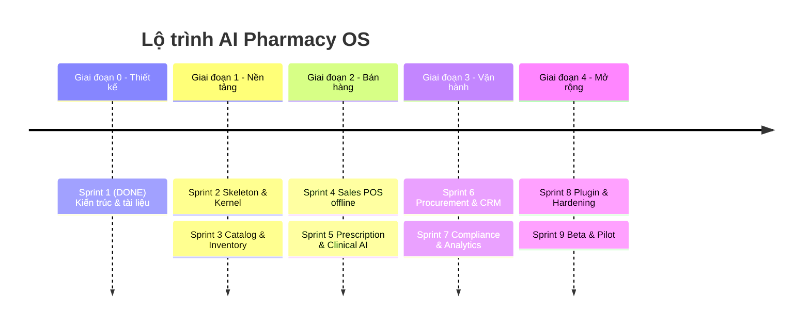

# ROADMAP — AI Pharmacy OS

> Lộ trình phát triển theo sprint. Cập nhật cuối: **2026-07-21**.
> Nguyên tắc: mỗi sprint có Definition of Done rõ ràng; không tràn phạm vi.

---

## Tổng quan giai đoạn

---

## ✅ Sprint 1 — Thiết kế kiến trúc *(HOÀN THÀNH)*

**Mục tiêu:** Thiết kế toàn bộ hệ thống, không viết code sản phẩm.

**Deliverables:**
- [x] Phân tích nghiệp vụ, actor, FR/NFR ([01](docs/01_ANALYSIS.md))
- [x] Kiến trúc C4 + Hexagonal + ADR ([02](docs/02_ARCHITECTURE.md))
- [x] ERD + schema DB ([03](docs/03_DATABASE_ERD.md))
- [x] Cấu trúc thư mục monorepo ([04](docs/04_FOLDER_STRUCTURE.md))
- [x] Phụ thuộc + quy tắc import ([05](docs/05_DEPENDENCIES.md))
- [x] Workflow nghiệp vụ ([06](docs/06_WORKFLOWS.md))
- [x] UML class/state/component ([07](docs/07_UML.md))
- [x] Đặc tả module ([08](docs/08_MODULES.md))
- [x] Plugin system ([09](docs/09_PLUGIN_SYSTEM.md))
- [x] Config ([10](docs/10_CONFIG.md))
- [x] API design ([11](docs/11_API_DESIGN.md))
- [x] AI integration ([12](docs/12_AI_INTEGRATION.md))
- [x] README, ROADMAP, PROJECT_STATE

**DoD:** ✅ README + ROADMAP + PROJECT_STATE hoàn chỉnh. **Không chuyển sang lập trình.**

---

## ✅ Sprint 2 — Skeleton & Kernel *(HOÀN THÀNH — 2026-07-21)*

**Mục tiêu:** Dựng bộ khung chạy được của kernel, chưa nghiệp vụ.

- [x] Khởi tạo monorepo backend, `pyproject.toml` (hatchling, PEP 621), git.
- [x] `core/`: config (Pydantic Settings, fail-fast prod), DI container, EventBus in-process (isolate handler), UnitOfWork (publish-after-commit), RequestContext.
- [x] `core/`: security (bcrypt password, JWT, RBAC), audit logger, AI `LLMProvider` port, plugin loader (entry points), errors (RFC 7807).
- [x] DB: async engine, `Base` + mixins, Alembic init, migration `0001` bật `vector` + `pgcrypto`.
- [x] `import-linter` (3 contract) + CI workflow (ruff, format, import-linter, mypy strict, pytest).
- [x] Health endpoint + OpenAPI (`/api/v1/health`, `/api/v1/docs`).
- [x] Docker compose (postgres pgvector + redis), Dockerfile, Makefile, bootstrap.sh.

**DoD:** ✅ Đạt. Bằng chứng đã chạy thật:
- `docker compose up` → postgres + redis **healthy**.
- `alembic upgrade head` áp dụng trên Postgres live; `vector` + `pgcrypto` đã bật.
- `pytest` **21 passed**; `mypy` strict **no issues (35 files)**; `ruff`/format sạch; `import-linter` **3 kept, 0 broken**.
- `modules/` rỗng đúng chủ đích — chưa nghiệp vụ.

> Ghi chú: dùng `pip`/`venv` (không có `uv`); FE `pnpm` workspace hoãn sang khi bắt đầu code FE (Sprint 4).

---

## Sprint 3 — Catalog & Inventory *(kế tiếp)*

- [ ] Module `catalog`: Drug, đơn vị quy đổi, ATC, phân loại Rx.
- [ ] Module `inventory`: ProductBatch, StockMovement (event-sourced), FEFO allocator, balances.
- [ ] Cảnh báo cận date / dưới định mức.
- [ ] Seed dữ liệu tham chiếu (ATC, đơn vị).
- [ ] API + test integration.

**DoD:** Nhập lô → tồn kho phản ánh; FEFO chọn đúng lô; test ≥ 80% domain.

---

## Sprint 4 — Sales / POS offline

- [ ] Module `sales`: SalesOrder, items, payments, returns.
- [ ] Idempotency (`client_uuid`), endpoint `/sync/sales`.
- [ ] Sự kiện `SaleCompleted` → inventory trừ tồn FEFO.
- [ ] FE POS tối thiểu + Dexie offline queue.
- [ ] Chặn ETC thiếu đơn (rule).

**DoD:** Bán offline → online sync không nhân đôi; tồn kho đúng.

---

## Sprint 5 — Prescription & Clinical AI

- [ ] Module `prescription`: state machine, xác thực, cấp phát.
- [ ] `core/ai`: LLMProvider (Anthropic), AI Gateway, guardrails.
- [ ] RAG: pgvector, chunk/embed tri thức dược mẫu.
- [ ] Module `clinical`: rule engine tương tác + LLM diễn giải; dose/substitute.
- [ ] Trích xuất đơn từ ảnh (vision).
- [ ] Ghi `ai_recommendations`, human-in-the-loop.

**DoD:** Kiểm tra tương tác trả kết quả có nguồn + confidence; log đầy đủ; dược sĩ duyệt được.

---

## Sprint 6 — Procurement & CRM

- [ ] Module `procurement`: Supplier, PO, GRN → inventory IN.
- [ ] Module `crm`: Customer, dị ứng, bệnh nền, lịch sử.
- [ ] Kết nối dị ứng KH vào kiểm tra clinical.

**DoD:** Nhập PO→GRN tạo lô; lịch sử KH cập nhật từ sự kiện bán/cấp phát.

---

## Sprint 7 — Compliance & Analytics

- [ ] Module `compliance`: sổ thuốc kiểm soát, transactional outbox, audit query.
- [ ] Module `analytics`: dashboard, dự báo nhu cầu, đề xuất nhập.
- [ ] Report xuất khẩu.

**DoD:** Sổ kiểm soát khớp movements; dashboard hiển thị số liệu thật; đề xuất nhập sinh PO nháp.

---

## Sprint 8 — Plugin & Hardening

- [ ] Plugin loader hoàn chỉnh (entry points, hooks, vòng đời).
- [ ] `dav_connector` (liên thông), `payment_vnpay`.
- [ ] Bảo mật: 2FA vai trò nhạy cảm, rate limit, mã hóa at-rest.
- [ ] Observability đầy đủ (tracing, metrics, alert).
- [ ] Load test POS (p95 < 300ms).

**DoD:** Bật/tắt plugin không sửa lõi; liên thông gửi thử thành công; chỉ tiêu NFR đạt.

---

## Sprint 9 — Beta & Pilot

- [ ] Triển khai staging → pilot 1 nhà thuốc thật.
- [ ] Đào tạo, phản hồi, sửa lỗi.
- [ ] Tài liệu vận hành & backup/restore.

**DoD:** Pilot chạy 2 tuần ổn định; checklist go-live đạt.

---

## Backlog (sau v1)

- Ứng dụng bệnh nhân, sàn B2C.
- Claim BHYT tự động.
- Schema-per-tenant cho khách hàng lớn.
- Tách microservice cho module tải cao (thay EventBus bằng broker).
- Đa ngôn ngữ giao diện.

---

## Nguyên tắc quản trị lộ trình

- Mỗi sprint **không** bắt đầu code khi thiết kế liên quan chưa chốt.
- Thay đổi phạm vi → cập nhật ROADMAP + PROJECT_STATE cùng lúc.
- ADR mới → lưu `docs/adr/`.
