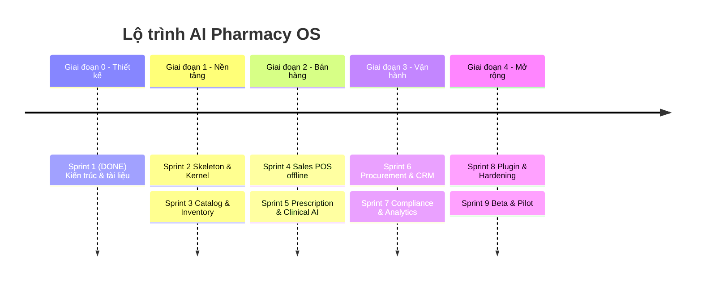

# ROADMAP — AI Pharmacy OS

> Lộ trình phát triển theo sprint. Cập nhật cuối: **2026-07-21**.
> Nguyên tắc: mỗi sprint có Definition of Done rõ ràng; không tràn phạm vi.

---

## Tổng quan giai đoạn

---

## ✅ Sprint 1 — Thiết kế kiến trúc *(HOÀN THÀNH)*

**Mục tiêu:** Thiết kế toàn bộ hệ thống, không viết code sản phẩm.

**Deliverables:**
- [x] Phân tích nghiệp vụ, actor, FR/NFR ([01](docs/01_ANALYSIS.md))
- [x] Kiến trúc C4 + Hexagonal + ADR ([02](docs/02_ARCHITECTURE.md))
- [x] ERD + schema DB ([03](docs/03_DATABASE_ERD.md))
- [x] Cấu trúc thư mục monorepo ([04](docs/04_FOLDER_STRUCTURE.md))
- [x] Phụ thuộc + quy tắc import ([05](docs/05_DEPENDENCIES.md))
- [x] Workflow nghiệp vụ ([06](docs/06_WORKFLOWS.md))
- [x] UML class/state/component ([07](docs/07_UML.md))
- [x] Đặc tả module ([08](docs/08_MODULES.md))
- [x] Plugin system ([09](docs/09_PLUGIN_SYSTEM.md))
- [x] Config ([10](docs/10_CONFIG.md))
- [x] API design ([11](docs/11_API_DESIGN.md))
- [x] AI integration ([12](docs/12_AI_INTEGRATION.md))
- [x] README, ROADMAP, PROJECT_STATE

**DoD:** ✅ README + ROADMAP + PROJECT_STATE hoàn chỉnh. **Không chuyển sang lập trình.**

---

## ✅ Sprint 2 — Skeleton & Kernel *(HOÀN THÀNH — 2026-07-21)*

**Mục tiêu:** Dựng bộ khung chạy được của kernel, chưa nghiệp vụ.

- [x] Khởi tạo monorepo backend, `pyproject.toml` (hatchling, PEP 621), git.
- [x] `core/`: config (Pydantic Settings, fail-fast prod), DI container, EventBus in-process (isolate handler), UnitOfWork (publish-after-commit), RequestContext.
- [x] `core/`: security (bcrypt password, JWT, RBAC), audit logger, AI `LLMProvider` port, plugin loader (entry points), errors (RFC 7807).
- [x] DB: async engine, `Base` + mixins, Alembic init, migration `0001` bật `vector` + `pgcrypto`.
- [x] `import-linter` (3 contract) + CI workflow (ruff, format, import-linter, mypy strict, pytest).
- [x] Health endpoint + OpenAPI (`/api/v1/health`, `/api/v1/docs`).
- [x] Docker compose (postgres pgvector + redis), Dockerfile, Makefile, bootstrap.sh.

**DoD:** ✅ Đạt. Bằng chứng đã chạy thật:
- `docker compose up` → postgres + redis **healthy**.
- `alembic upgrade head` áp dụng trên Postgres live; `vector` + `pgcrypto` đã bật.
- `pytest` **21 passed**; `mypy` strict **no issues (35 files)**; `ruff`/format sạch; `import-linter` **3 kept, 0 broken**.
- `modules/` rỗng đúng chủ đích — chưa nghiệp vụ.

> Ghi chú: dùng `pip`/`venv` (không có `uv`); FE `pnpm` workspace hoãn sang khi bắt đầu code FE (Sprint 4).

---

## ✅ Sprint 3 — Catalog & Inventory *(HOÀN THÀNH — 2026-07-21)*

- [x] Module `catalog`: `Drug`, đơn vị quy đổi (`DrugUnit`, hệ số về base unit), ATC, phân loại Rx (OTC/ETC/CONTROLLED). Hexagonal 4 lớp.
- [x] Module `inventory`: `ProductBatch`, `StockMovement` (event-sourced), `allocate_fefo` (domain thuần), projection `stock_balances`.
- [x] Cảnh báo cận date (`/inventory/alerts/near-expiry`) + sự kiện `LowStockDetected` khi hết định mức.
- [x] Seed dữ liệu tham chiếu (10 mã ATC) — idempotent, chạy `make seed`.
- [x] API v1 (`/drugs`, `/inventory/receive|dispense|on-hand|alerts`) + test integration (service + HTTP e2e).
- [x] Migration `0002_catalog_inventory` (6 bảng) — autogenerate, áp dụng live, reversible, `alembic check` không drift.
- [x] Contract kiến trúc mới: domain purity (không import framework) + module independence (catalog ⟂ inventory).

**DoD:** ✅ Đạt. Bằng chứng đã chạy thật:
- Nhập lô → `on_hand` phản ánh (test + HTTP e2e trên Postgres/SQLite).
- FEFO chọn đúng lô cận date nhất, chặn xuất quá tồn (rollback), loại lô hết hạn.
- Test **46 passed**; **domain coverage 97%** (≥ 80%); `mypy` strict; `import-linter` **6/0**; `ruff`/format sạch.
- Sự kiện `StockMovedIn/Out` publish sau commit (test kiểm chứng thứ tự).

---

## Sprint 4 — Sales / POS offline *(BACKEND HOÀN THÀNH — 2026-07-21)*

- [x] Module `sales`: SalesOrder, items, payments, returns (Hexagonal 4 lớp).
- [x] Idempotency (`client_uuid`), endpoint `/sync/sales` (upsert 200).
- [x] Sự kiện `SaleCompleted` → inventory trừ tồn FEFO (nối ở composition root; idempotent cấp đơn; thiếu tồn → `StockShortfallDetected`, không chặn bán).
- [x] Chặn ETC thiếu đơn — catalog là nguồn thẩm quyền qua port `DrugInfoProvider` + adapter.
- [x] FE POS tối thiểu (S4.6, hồi sinh 2026-07-23) — đăng nhập JWT thật, tra thuốc, giỏ hàng,
      thanh toán `POST /sales`. `frontend/` mới, không sửa module backend nào ngoài CORS
      (`main.py`, xin phép riêng). Xem `frontend/README.md` mục "Phạm vi hiện tại".
- [x] Dexie offline queue (S4.6 Bước 5, 2026-07-23) — mất mạng lúc thanh toán thì lưu vào
      IndexedDB (`frontend/src/shared/offline/`), tự đồng bộ qua `POST /sync/sales` khi có mạng
      lại. Xem `frontend/README.md` mục "Hàng đợi offline".

**DoD backend:** ✅ Đạt. Bán → tồn giảm đúng FEFO; re-sync cùng `client_uuid` **không nhân đôi** tồn/đơn; ETC thiếu đơn bị chặn (422); bán quá tồn không làm tồn âm.

**DoD FE (S4.6, 5/5 bước):** ✅ Đăng nhập thật + chọn chi nhánh · tra thuốc (lọc client, `GET /drugs`
không có tham số tìm kiếm — lệch docs/11) · giỏ hàng · `POST /sales` thành công · hàng đợi offline
Dexie khi mất mạng, tự đồng bộ khi có mạng lại. Đã kiểm chứng bằng curl mô phỏng đúng request FE
gửi trên backend live + `next dev` thật (không chỉ `next build`).
**Chưa test bằng trình duyệt thật** (môi trường không có browser tool) — chỉ xác nhận hợp đồng API
khớp 100% qua curl và server không lỗi runtime; luồng offline (ngắt mạng, gõ đơn, bật mạng lại) mới
xác nhận đúng bằng code review + phân biệt lỗi `ApiError` vs lỗi mạng, **chưa tự tay diễn tập trên
trình duyệt thật**. Sếp cần tự mở trình duyệt kiểm tra trước khi coi Sprint 4 là "offline-first"
thật sự.
- Migration `0003_sales` (unique `tenant_id`+`client_uuid`) apply→`alembic check` không drift→reversible.
- `import-linter` **7/0** (thêm `sales-domain-innermost`; 2 điểm cross-module nối ở lớp `api`, `module-independence` giữ nguyên); `mypy` strict 90 file; `pytest` **94 passed** (+40 so với 54).

---

## Sprint 5 — Prescription & Clinical AI *(DONE ở mức MOCK — 2026-07-22)*

- [x] Module `prescription`: state machine, xác thực, cấp phát *(S5.1–S5.4)*.
- [x] `core/ai`: `LLMProvider` port + guardrail human-in-the-loop. **Impl = `MockLLMProvider`** (KHÔNG gọi API).
      🔒 **BLOCKER:** `AnthropicProvider` thật chờ `AI__API_KEY` + SDK.
- [x] Module `clinical` (A1): rule engine tương tác chéo (bảng `drug_interactions`, tất định) + LLM **diễn giải** (mock);
      full 4 lớp Hexagonal + endpoint `POST /clinical/check-interactions` (+ get/accept recommendation).
- [x] Ghi `ai_recommendations`, human-in-the-loop (dược sĩ `accept`, guardrail `requires_review`).
- [ ] 🔒 **BLOCKER — RAG:** pgvector `drug_knowledge_chunks` chưa tạo (cột `vector(1536)` phá test-harness SQLite + nguồn tri thức
      dược thật/bản quyền chưa có). Tạo bảng+index+migration riêng khi làm RAG thật. **Quyết định đã chốt:** hoãn, không stub rỗng.
- [ ] 🔒 **BLOCKER — hoạt chất:** `catalog` chưa có `active_ingredients`/`drug_ingredients` ⇒ chưa map `drug_id→hoạt chất` ⇒
      auto-check tương tác ở sale/prescription (5.5.4) hoãn. **Quyết định đã chốt:** KHÔNG thêm vào catalog vội — gộp cùng mạch
      dị ứng KH ở **Sprint 6** (xem dưới). Nay `/clinical/check-interactions` nhận danh sách hoạt chất tường minh.
- [ ] Dose-check / substitute / trích xuất đơn từ ảnh (vision) — hoãn (A2–A6, ngoài phạm vi lõi A1).

**DoD:** ✅ Kiểm tra tương tác trả kết quả **có nguồn + confidence**; log `ai_recommendations` đầy đủ; dược sĩ duyệt được.
**Đạt qua MOCK** (`MockLLMProvider`, e2e HTTP thật). Phần AI/RAG **thật** vẫn blocker (chờ API key + nguồn tri thức dược).

---

## ✅ Sprint 6 — Procurement & CRM *(HOÀN THÀNH — 2026-07-22, DoD lõi)*

- [x] **Mô hình hoạt chất trong `catalog`** (`active_ingredients`/`drug_ingredients`) — gỡ blocker S5.5, map `drug_id→hoạt chất`. *(2026-07-22)*
- [x] **Auto-check tương tác (clinical 5.5.4)** *(2026-07-22)* — nối `clinical.check_interactions` vào sale/prescription ở composition
      root (`wire_safety_checks`), **cảnh báo không chặn**, tenant-gated. Module-independence giữ nguyên (11 kept/0).
- [x] Module `crm`: Customer, dị ứng, bệnh nền, lịch sử — nối **dị ứng KH** vào kiểm tra clinical *(2026-07-22)* — `check_allergies`
      thuần + đọc crm ở dispense (chỉ luồng prescription; OTC hoãn). Lịch sử KH từ event bán/cấp phát: **chưa** (còn treo).
- [x] **Feature flag AI theo tenant (SaaS)** *(2026-07-22)* — `clinical.TenantAiSettings`, mỗi nhà thuốc bật/tắt AI độc lập.
- [x] Module `procurement`: Supplier, PO, GRN → inventory IN *(2026-07-22)* — đủ 4 lớp Hexagonal (migration `0011`) + cross-module
      `GoodsReceived` → `InventoryService` tạo lô ở composition root (`wire_goods_receipt_stock_in`), idempotent theo `grn_id`; va
      chạm lô/lỗi ghi `stock_reconciliation_needed` (migration `0012`). Module-independence giữ nguyên (12 kept/0).

**DoD:** ✅ Nhập PO→GRN tạo lô (đạt) · ✅ cờ AI cấu hình theo từng tenant (đạt). ⚠️ *lịch sử KH cập nhật từ sự kiện bán/cấp phát*
**hoãn sang Sprint 7** (sếp chốt hoãn — cross-module riêng, không chặn đóng Sprint 6).

> **Đóng Sprint 6:** 372 test xanh · import-linter 12/0 · mypy strict 178 file · migration `0008`..`0012` live/reversible. Nợ mang
> sang Sprint 7: ~~`MedicationHistoryEntry` từ event~~ (XONG 2026-07-24, §7ad), ~~dị ứng OTC~~ (XONG 2026-07-24, §7ad),
> ~~gộp lô (PA B)~~ (XONG 2026-07-23, §7ac), ~~API resolve reconciliation~~ (XONG 2026-07-23, §7ab). **Còn: outbox bền.**

---

## Sprint 7 — Compliance & Analytics

- [x] **`iam` — module IAM thật** (users/roles/JWT 2 cấp chuỗi-nhà thuốc, thay dev-header).
      *Kéo lên trước vì là điều kiện tiên quyết của mọi tính năng chạm dữ liệu nhạy cảm
      (`docs/14` Bước 1.5). Xong 2026-07-23 — `docs/15_IAM_DESIGN.md`, PROJECT_STATE §7k.*
- [x] **`audit_logs` persist** (append-only + `GET /audit-logs` mức tối thiểu).
      *Gỡ nợ F8. Xong 2026-07-23 — PROJECT_STATE §7l. Dashboard/analytics audit vẫn thuộc sprint này.*
- [x] **Hồ sơ sức khỏe khách hàng** — ngoài ROADMAP gốc, đã qua cổng `docs/14` Bước 0-4 và được
      duyệt 2026-07-23: `docs/features/ho-so-suc-khoe-khach-hang/01_DECISIONS.md`.
      Đồng ý tách 2 mức · tách `crm.sensitive.read` · 6 action audit · export/khử nhận dạng ·
      endpoint metadata DPIA. ~~**Ngoài phạm vi:** `SalesOrder.customer_id`, ghi
      `MedicationHistoryEntry` tự động (2 cross-module, tách bước riêng).~~ **2 việc "tách bước riêng"
      này nay XONG 2026-07-24** (phiên Opus full-auto, PROJECT_STATE §7ad): `SalesOrder.customer_id`
      (mig `0016`) + ghi `MedicationHistoryEntry` tự động từ `SaleCompleted`/`PrescriptionDispensed`
      (consent-gated) + dị ứng OTC.
      *4/4 bước xong 2026-07-23 — PROJECT_STATE §7m/§7t mục A1. (Checkbox cập nhật 2026-07-23, đã
      xong từ trước — tài liệu lệch với thực tế, phát hiện khi rà soát việc tiếp theo.)*
- [x] `compliance`: sổ thuốc kiểm soát (C.1–C.5, PROJECT_STATE §7b) + router HTTP (§7q) — **XONG**.
- [x] **Outbox/retry bền** (`event_outbox`, migration `0017`+`0018`) — **XONG 2026-07-24**,
      PROJECT_STATE §7ag/§7ai. Mọi `UnitOfWork` ghi sự kiện trong chính giao dịch nghiệp vụ; relay
      giao lại at-least-once. Thay hoàn toàn cơ chế **phát sự kiện** best-effort cũ (publish sau
      commit — chết giữa chừng là mất hẳn sự kiện).
      *Phạm vi chưa bao gồm:* vòng retry đẩy DAV — **đã đóng riêng 2026-07-25** (PROJECT_STATE §7ay,
      docs/13 mục D.4): hàng đợi `national_sync_retry_tasks` + `NationalSyncRetryRelay` nền
      (`NATIONAL_SYNC__RETRY_ENABLED`, migration `0027`). Không dùng lại `event_outbox` — outbox lõi
      chỉ retry khâu **đưa sự kiện lên bus**, không retry việc subscriber làm gì với sự kiện. **Kết
      nối DAV thật vẫn chặn** ở `# BLOCKER: DAV API spec`; chỉ hạ tầng gửi lại là xong.
- [x] Audit query dashboard — **XONG 2026-07-24 (§7al).** Dựng như **kernel-infra** (`core/audit` +
      endpoint `api/v1/audit-dashboard`), KHÔNG trong `compliance` như phác thảo cũ. Quyền RIÊNG
      `audit.dashboard.read` (admin+chain+branch, không cashier/warehouse) tách khỏi `audit.read`; lọc
      actor+time+`target_type`+action; export CSV. `/audit-logs` mức tối thiểu (§7l) vẫn giữ nguyên.
- [x] Module `analytics` — **XONG 2026-07-25 (§7ap)**. Yêu cầu chốt 2026-07-24 (GĐ, PROJECT_STATE
      §7am) + thiết kế Chain duyệt 2026-07-25 (`docs/features/analytics/00_DESIGN_PROPOSAL.md`).
      Dự báo v1 = trung bình trượt 90 ngày + mốc tái đặt hàng, cấp **thuốc × chi nhánh**; đề xuất
      nhập sinh **PO nháp** trong `procurement` (không tự gửi NCC, `unit_price=0` chờ người điền);
      dashboard = doanh thu/top thuốc/cảnh báo cận date+tồn thấp/số PO nháp chờ duyệt. Quyền mới
      `analytics.read` + `analytics.reorder.run` (admin/chain/branch, KHÔNG cashier/warehouse).
      Cross-module qua 5 adapter ở `api/v1/analytics_wiring.py` — `analytics` không import module
      nào khác (2 contract import-linter mới). Bảng `reorder_suggestions` (mig `0022`).
      *Hoãn v2 như đã chốt:* phát hiện bất thường + mùa vụ/dịch bệnh; lead-time/tồn an toàn còn là
      mặc định toàn hệ thống, chưa cho override theo tenant; tính toán chỉ chạy on-demand.
- [x] Report xuất khẩu — **đợt 1 XONG 2026-07-24 (§7an)**: doanh thu ngày/tuần/tháng theo chi nhánh
      (`GET /reports/revenue/export`) + tồn kho theo lô/HSD (`GET /reports/inventory/stock/export`),
      CSV stream (tái dùng `csv_export.py`/helper stream từ audit dashboard), quyền tái dùng
      `sales.read`/`inventory.read` — không quyền mới, không migration.
      Lọc **"theo nhân viên bán hàng" XONG 2026-07-25 (§7ao)**: thêm cột `sold_by_user_id` (mig `0021`)
      + `GET /reports/revenue/export?sold_by_user_id` (Chain duyệt PA (a)).
      **Đợt 2 XONG TRỌN 2026-07-25 (§7ax, Sonnet):** top thuốc bán chạy — `GET /reports/top-drugs/export`
      (tái dùng `aggregate_sold_by_drug` đã có cho `analytics`, không migration). *Xuất
      `ControlledLedgerEntry` hoá ra đã XONG từ trước* qua mạch TT18 (`GET
      /compliance/controlled-ledger/books/{book_type}/export`, §7ar) — phát hiện khi rà lại phạm vi
      đợt 2 trước khi code, tránh làm trùng.

**DoD:** ✅ Đạt (2026-07-25). Bằng chứng đã chạy thật trên Postgres có dữ liệu, không chỉ pytest:
- ✅ Sổ kiểm soát khớp movements (C.1–C.5, §7b).
- ✅ Dashboard hiển thị số liệu **thật** — `GET /analytics/dashboard` trả doanh thu/top thuốc khớp
  dữ liệu bán thật trên DB đang chạy (§7ap).
- ✅ Đề xuất nhập sinh PO nháp — materialize tạo `purchase_orders` DRAFT thật, verify bằng SQL (§7ap).
- ✅ Hồ sơ sức khỏe KH trả lời 6 câu hỏi thanh tra; thu ngân không xem được dị ứng/bệnh nền
  (`crm.sensitive.read` tách riêng, §7m).

*Nợ mang sang, đã ghi rõ — không tính vào DoD (cập nhật 2026-07-25):* ~~(1) report đợt 2~~ **ĐÃ ĐÓNG
(§7ax)**; ~~(2) vòng retry đẩy DAV của `NationalSyncService`~~ **ĐÃ ĐÓNG (§7ay** — relay riêng, không
qua `event_outbox`; kết nối DAV thật vẫn chặn ở đặc tả API**)**;
(3) cảnh báo/khoá tồn-âm khi outbox chạy async ([TODO.md](TODO.md)) — gộp vào Sprint 8 load test;
(4) `analytics` v2 (bất thường, mùa vụ, override lead-time theo tenant, chạy nền định kỳ) — Sprint 8/9.

---

## Sprint 8 — Plugin & Hardening

- [x] **Plugin loader hoàn chỉnh** (entry points, hooks, vòng đời) — **XONG 2026-07-26 (§7ba)**, mục
      1/4 của quy trình cổng nghiêm ngặt (§7az). Tách bật/tắt khỏi khám phá (`PLUGINS__ENABLED`, mặc
      định rỗng — cài package ≠ bật) · validate trước `setup()` (contract + so khớp major
      `api_version`) · **fail-fast** khi plugin đã bật nạp lỗi · `HookRegistry` 1 plugin/port, xung
      đột báo lỗi nêu tên cả hai · **hook runtime đổi thành `async`** (hook sync gọi mạng đứng cả
      event loop, và không timeout được). Kiểm tra bằng package cài thật, không chỉ test.
      *Nợ ghi rõ:* 2 contract import-linter cấm plugin import `modules` — **chưa thêm được** cho tới
      khi có package plugin thật, phải làm cùng `payment_vnpay`; event hook + circuit breaker +
      timeout tại điểm gọi hoãn; **không có sandbox thật** (rủi ro đã duyệt chấp nhận).
- [ ] `dav_connector` (liên thông), `payment_vnpay`.
- [ ] Bảo mật: ~~2FA vai trò nhạy cảm~~ **XONG 2026-07-26 (§7bb)**, rate limit, mã hóa at-rest.
      2FA = mục 2/4 quy trình cổng nghiêm ngặt (§7az). TOTP (RFC 6238, không SMS — POS
      offline-first nên yếu tố thứ hai không được phụ thuộc mạng lúc đăng nhập); phạm vi suy từ
      **quyền đang giữ** (`compliance.ledger.sign` + `iam.role.assign/write` → 3 role) chứ không
      phải danh sách role chép tay; cưỡng chế ở **cả login lẫn step-up khi ký sổ** (hai đường tấn
      công khác nhau — máy quầy bỏ trống chỉ step-up chặn được); 10 mã dự phòng + admin reset +
      **break-glass CLI** `seeds.reset_two_factor` (bịt ca nhà thuốc 1 admin mất cả thiết bị lẫn mã
      dự phòng ⇒ khoá vĩnh viễn). Cờ `SECURITY__TWO_FACTOR_ENFORCED` mặc định tắt; bật lên **không
      khoá ai** — chỉ chặn cứng hành vi ký sổ. Kiểm tra thật trên Postgres + uvicorn thật (17 mục).
      *Nợ:* mã hoá at-rest cột secret (đúng mục 3/4 kế tiếp), reset 2FA không thu hồi phiên đang mở,
      `crm.erase` chưa vào phạm vi, rate limit theo IP chưa có.
- [ ] Observability đầy đủ (tracing, metrics, alert).
- [x] Load test POS — **p95 < 300 ms Ở 8 PHIÊN ĐỒNG THỜI** *(mức tải bổ sung 2026-07-28, GĐ chốt
      dưới uỷ quyền)*. Đo thật trên staging: **217,6 ms @ 8 luồng** ✅ · 490,4 ms @ 16 luồng.
      *Vì sao phải ghi kèm mức tải:* "p95 < 300 ms" trần trụi **không quyết được đạt hay không** —
      cùng một hệ thống đạt ở 8 luồng và trượt ở 16. Một nhà thuốc 2–3 quầy cộng tác vụ nền ⇒ 8
      luồng cho **~3 lần dư địa**. Đo lại khi biết quy mô nhà thuốc pilot thật.

**DoD:** Bật/tắt plugin không sửa lõi; liên thông gửi thử thành công; chỉ tiêu NFR đạt.

---

## Sprint 9 — Beta & Pilot

- [ ] Triển khai staging → pilot 1 nhà thuốc thật.
- [ ] Đào tạo, phản hồi, sửa lỗi.
- [ ] Tài liệu vận hành & backup/restore.
- [x] **FE cho `analytics`** — ✅ **XONG 2026-07-28** (§7bt). Hai màn: bảng điều hành + đề xuất đặt hàng.
      Chạy thật trên nhà thuốc demo, phát sinh đơn mua **PO-0006**. *(quyết định 2026-07-25, §7ax)* — dashboard
      doanh thu/top thuốc/cảnh báo tồn + màn duyệt PO nháp, hiện chỉ có API (`GET /analytics/dashboard`,
      §7ap). Đặt ở Sprint 9 chứ không Sprint 8: chủ đề Sprint 8 là Hardening hạ tầng thuần (plugin/bảo
      mật/observability/load test), không phải feature UI; pilot thật (Sprint 9) mới cần giao diện hoàn
      chỉnh để dược sĩ/quản lý dùng — trong lúc chờ, admin/chain vẫn đọc được số liệu qua API trực tiếp,
      không chặn nghiệp vụ vì đây là tính năng phụ trợ (dự báo/đề xuất), không phải luồng lõi hàng ngày.

**DoD:** Pilot chạy 2 tuần ổn định; checklist go-live đạt.

---

## Sprint 10 — Bản demo cho khách hàng *(2026-07-28)*

Chain: *"code tiếp, đúng quy trình, ủy quyền quyết liên tục cho đến có sản phẩm demo
gửi khách hàng."* Tổng **12 bước**, chốt trước khi bắt đầu (kỷ luật #12).

- [x] **D1–D3** ba cổng đọc còn thiếu: `GET /sales`, `GET /purchase-orders`,
      `GET /inventory/stock` (+ lọc `search`/`ids` cho `GET /drugs`).
- [x] **D4** `seeds.demo_pharmacy` — 36 thuốc, 72 lô, 279 hoá đơn / 28 ngày.
- [x] **D5–D9** bốn màn quản lý (Tồn kho · Hoá đơn · Khách hàng · Đơn mua hàng)
      + khung điều hướng 7 mục gating theo quyền, tên chi nhánh thật.
- [x] **D10** cột `drugs.sale_price` (migration 0037) — màn bán hàng hết hỏi giá
      từng dòng bằng `window.prompt`.
- [x] **D11** `make demo` — một lệnh, CSDL riêng.
- [x] **D12** `docs/20_DEMO_KHACH_HANG.md` — kịch bản 10 phút, đã chạy thật hết
      đường: đăng nhập → bán → hoá đơn → tồn kho → bảng điều hành → đề xuất →
      **PO-0004**.

**Còn nợ:** chưa có mắt người nào nhìn bốn màn mới (công cụ trình duyệt không có
trong phiên) · frontend vẫn **không có một test nào**.

---

## Đợt V3 — rà soát quy trình vận hành (Chain nêu 2026-08-04)

> Sinh từ lượt Chain tự dùng thử trên LAN bằng tài khoản **chủ chuỗi**. Mọi mục dưới đây đã
> **tra thẳng mã nguồn để xác nhận**, không ghi theo cảm nhận — chỗ nào Chain thấy khác thực
> tế thì ghi rõ nguyên nhân thật.
>
> Xếp theo **mức chặn việc thật**, không theo thứ tự Chain nêu.

### V3-1 ✅ XONG 2026-08-04 — Thêm thuốc mới, gọi được giữa lúc nhập hàng

| | |
|---|---|
| Thực tế | Backend **có** `POST /catalog/drugs`; grep toàn frontend: **không dòng nào gọi**. Màn Danh mục thuốc chỉ có *Sửa giá* · *Sửa hoạt chất*. Thuốc vào `qt650` là do chạy seed |
| Hệ quả | Nhận hàng gặp mặt hàng lạ ⇒ **dừng**, không đường đi tiếp. Ba mục còn lại chỉ gây bất tiện; mục này gây bế tắc |
| Việc | Thêm màn/drawer tạo thuốc, **gọi được ngay giữa luồng nhập hàng** (không bắt thoát ra rồi quay lại) |
| **Đã làm** | `ThemThuocDialog` dùng chung cho `/danh-muc-thuoc` và `/nhap-nhanh`. Tạo xong **chọn sẵn mã mới**, dữ liệu gõ dở còn nguyên. Ảnh + cổng: `docs/ui-history/2026-08-04-them-thuoc/` |

### V3-2 Không có nút TẠO ĐƠN MUA HÀNG thủ công

| | |
|---|---|
| Thực tế | Backend đủ: `POST /purchase-orders` · `/place` · `/cancel` · `/close`. Frontend chỉ có **GET** + luồng nhận hàng. Đường duy nhất đẻ ra đơn hôm nay: **Đề xuất đặt hàng → "Tạo đơn nháp"** |
| Hệ quả | Ca trình dược viên chào hàng tận quầy **không có đề xuất nào** ⇒ không dựng được đơn |
| Việc | Nút tạo đơn ở `/don-mua-hang`. Rẻ nhất trên mỗi đồng bỏ ra — chỉ thiếu màn |

### V3-3 Gộp Đơn mua hàng ↔ Đề xuất đặt hàng

**Không gộp làm một màn.** Thực tế đã gộp một nửa (đề xuất là cửa duy nhất tạo đơn). Chỗ vướng
thật nằm chỗ khác: `materialize()` tạo **một đơn nháp cho mỗi đề xuất**, mà mỗi đề xuất là
**một mặt hàng** ⇒ đặt 10 mặt hàng cùng một NCC sinh **10 đơn nháp rời**. Và đề xuất chỉ bấm
được khi thuốc **đã gán nhà cung cấp**.

⇒ Việc: **gom nhiều đề xuất cùng NCC thành một đơn**, giữ hai màn.

### V3-4 Trình tự 5 màn kho — gom lại thế nào (Chain hỏi 04/08)

Thứ tự đúng và phụ thuộc dữ liệu, đã tra mã:

| # | Màn | Khi nào | Lấy từ | Đẻ ra |
|---|---|---|---|---|
| 1 | Danh mục thuốc | Trước tất cả | — | `drug_id` |
| 2 | Sơ đồ kho | Trước khi xếp hàng | — | Kho→Khu→Kệ→Ô |
| 3 | Khởi tạo tồn kho | **Đúng một lần**, ngày chuyển từ sổ giấy | 1 + 2 | Lô, **không giá vốn** |
| 4 | Nhập hàng nhanh | Hằng ngày | 1 + 2 | Lô **có giá vốn** |
| 5 | Kiểm kê | Định kỳ | 2 + tồn hiện có | Chênh lệch chờ duyệt |

Hôm nay đã gom **2 cặp tab**: `Sơ đồ kho ↔ Kiểm kê` và `Nhập hàng nhanh ↔ Khởi tạo tồn`.

🔴 **KHÔNG gộp 3 với 4 dù nhìn giống nhau.** Khởi tạo gọi `/inventory/initialize`
(`is_initial=True`), nhập nhanh gọi `/inventory/receive`. Khởi tạo là đếm hàng **đã có trên
kệ**, thường không biết giá vốn thật — đi chung đường thì **giá vốn 0 bị kéo vào bình quân gia
quyền**, hỏng giá vốn mọi lô sau. Hai màn còn khác ở **thứ tự thao tác**: nhập nhanh cố định
*mặt hàng*, khởi tạo cố định *cái ô đang đứng trước mặt*.

⇒ Việc: **một màn "Bắt đầu dùng phần mềm"** dẫn 1→2→3 theo đúng thứ tự, có dấu đã-xong từng
bước. Không gộp chức năng, chỉ **chỉ đường** — hôm nay không màn nào nói cho người mới biết
phải làm gì trước.

**Nhập giữa chừng được không:** vị trí ô ✅ bỏ trống được, xếp sau · lô/hạn dùng ❌ bắt buộc ·
thuốc chưa có trong danh mục 🔴 **tắc** (xem V3-1).

### V3-5 Báo cáo CSV toàn mã máy, không đọc được

| Báo cáo | Tiêu đề cột thật trong mã |
|---|---|
| Doanh thu | `period_start, branch_id, currency, order_count, revenue_total` |
| Tồn kho | `batch_id, drug_id, branch_id, lot_no, expiry_date, quantity` |
| Thuốc bán chạy | `rank, drug_id, branch_id, quantity_sold, revenue` |

🔴 **Nặng hơn chuyện tiếng Anh: không báo cáo nào có TÊN THUỐC.** Chỉ `drug_id` dạng UUID. Mã
nguồn tự khai lý do — tránh đọc chéo module (`catalog` giữ tên thuốc), và *"để người tiêu thụ
CSV tự tra tên"*. Với một chủ quầy thì tệp ấy **bằng không**.

⇒ Việc: tiêu đề tiếng Việt · **thêm cột tên thuốc/tên chi nhánh** · định dạng ngày và tiền
theo lối Việt Nam. Đây là đọc chéo module có kiểm soát, cần thiết kế cổng đọc như `N-1` đã làm
cho hoá đơn.

### V3-6 Phân quyền ở mục Nhân viên — CÓ, nhưng chủ chuỗi không thấy

🔴 **Không phải thiếu tính năng.** `nhan-vien/page.tsx` có sẵn `RolePanel` cấp/thu hồi vai trò,
gác bằng `iam.role.assign`. Đã kiểm bằng lệnh:

| Quyền | Chủ chuỗi |
|---|---|
| `iam.user.read` · `iam.role.read` | ✅ có ⇒ **thấy được mục Nhân viên** |
| `iam.role.assign` · `iam.user.create` · `iam.user.write` | ❌ **không** ⇒ nút Vai trò **ẩn** |

Đây là thiết kế cố ý (docs/15 §5 Q5): *"chủ chuỗi không sửa được người dùng/vai trò, để một tài
khoản chuyên môn không tự nới rộng chính mình"*.

⇒ Vấn đề thật là **giao diện im lặng**: menu hiện ra, bảng hiện ra, nút biến mất, **không câu
nào giải thích**. Người dùng kết luận "phần mềm thiếu tính năng" — đúng như đã xảy ra.
⇒ Việc: khi thiếu quyền thì **nói ra** (*"Cần quyền cấp vai trò — liên hệ quản trị hệ thống"*),
đừng ẩn trơn. Áp cho **mọi** nút bị gác quyền, không riêng màn này.

### V3-7 Hoá đơn mua thuốc · giá vốn · lợi nhuận

| Thứ cần | Có chưa |
|---|---|
| Giá vốn từng lô | ✅ `cost_price`, bình quân gia quyền khi nhập thêm |
| Số hoá đơn NCC · VAT đầu vào · công nợ phải trả | ❌ **không trường nào** trong `procurement` |
| Báo cáo lợi nhuận / giá vốn hàng bán | ❌ `reports.py` **không có chữ `cost` nào** |

Chia làm hai việc **rất khác nhau về giá**:

- **V3-7a — Báo cáo lợi nhuận.** Dữ liệu **đã nằm sẵn**: giá bán ở `sale_lines`, giá vốn ở
  `product_batches`. Thiếu **người nối hai đầu**, không thiếu dữ liệu ⇒ rẻ hơn nhiều so với vẻ
  ngoài. **Cần Chain chốt chiều xem:** theo thuốc · theo ngày · hay theo nhà cung cấp.
- **V3-7b — Hoá đơn NCC, VAT, công nợ.** Thêm trường + migration, và **đụng ranh giới kế toán**.
  🔴 **Chưa code khi chưa có câu trả lời:** phần mềm dừng ở *ghi nhận nội bộ để theo dõi lợi
  nhuận*, hay *xuất số liệu khớp sổ thuế*? Hai đích cách nhau rất xa về khối lượng. Hỏi Trợ lý
  Kế toán **cùng lượt** với 3 câu chặn sổ quỹ tiền mặt đang treo — nhiều khả năng cùng một cụm.

### V3-8 Mảng AI — bản rút gọn, **đã thay bằng mục "Lộ trình AI — V4" bên dưới**

Trạng thái thật hôm nay, đã tra mã:

| Thành phần | Trạng thái |
|---|---|
| Cổng `core.ai.LLMProvider` | ✅ có, đã nối dây |
| Nhà cung cấp đang chạy | 🔴 **`MockLLMProvider`** — chưa gọi LLM thật lần nào |
| `AI__API_KEY` thật | 🔴 **BLOCKER** ghi sẵn trong `clinical/__init__.py` |
| Nguồn tri thức dược có bản quyền | 🔴 **BLOCKER** — chưa có |
| RAG (`drug_knowledge_chunks`) | 🔴 chưa dựng |
| Vết kiểm toán mỗi lượt gọi AI | ✅ `AiRecommendation` — model · prompt_hash · confidence · `requires_review` · người dược sĩ chấp nhận |

🔴 **Ranh giới đã khoá, không được nới khi thêm tính năng AI:** phán quyết an toàn là của
**bộ luật tất định** (bảng `drug_interactions`), **LLM chỉ giải thích**. Bốn việc Chain nêu
không cùng mức rủi ro:

| Việc Chain nêu | Rủi ro | Ghi chú |
|---|---|---|
| Trả lời câu hỏi doanh thu, lập báo cáo tài chính | **Thấp** — số liệu nội bộ, sai thì thấy ngay | Làm được trước, sau khi có V3-5 và V3-7a |
| Hỏi đáp về thuốc | **Trung bình** | Cần nguồn tri thức có bản quyền, không để LLM tự bịa |
| **Gợi ý toa thuốc** | 🔴 **Cao nhất** | Là **hành vi chuyên môn dược**. Phải qua `docs/14_FEATURE_PROCESS.md` Bước 0–3 và **Chain + Trợ lý Pháp Lý duyệt** trước khi viết dòng đầu tiên. Cùng họ ranh giới T3 của uỷ quyền: phần mềm không thay chứng chỉ hành nghề |

⇒ Việc trước mắt: **dựng luồng dữ liệu**, chưa dựng tính năng — gom nguồn số liệu sạch để AI
đọc đúng (doanh thu, tồn kho, giá vốn, danh mục). Đúng thứ tự tự nhiên: **V3-5 và V3-7a là
đầu vào của V3-8**, làm chúng trước thì phần AI rẻ đi.

### Thứ tự đề nghị

| Ưu tiên | Mục | Vì sao |
|---|---|---|
| ~~1~~ | ~~**V3-1** thêm thuốc mới~~ | ✅ **xong 04/08** |
| 2 | **V3-2** nút tạo đơn mua | Backend xong, chỉ thiếu màn |
| 3 | **V3-6** nói ra khi thiếu quyền | Rẻ, và sửa đúng loại hiểu nhầm vừa xảy ra |
| 4 | **V3-5** báo cáo đọc được | Đầu vào của V3-8 |
| 5 | **V3-7a** báo cáo lợi nhuận | Dữ liệu đã đủ — *chờ Chain chốt chiều xem* |
| 6 | **V3-4** màn dẫn đường bắt đầu | Sau khi V3-1 xong mới trọn nghĩa |
| 7 | **V3-3** gom đề xuất cùng NCC | Bất tiện, không chặn |
| 8 | **V3-7b** · **V3-8** | *Chờ Kế toán / chờ Pháp Lý + khoá API* |

---

## Lộ trình AI — V4 (Chain giao 2026-08-04)

> Chain giao: *"Đưa AI nghiệp vụ thuốc, kho, kế toán, thuế, đơn hàng… vào lộ trình AI"*, kèm
> một ví dụ cụ thể: **"tạo đơn thuốc đau dạ dày, ợ hơi cho bé 6 tuổi, 3 ngày thuốc → có ngay
> toa sẵn sàng bán → dược sĩ rà lại và chốt → ghi nhận AI đề xuất, dược sĩ duyệt"**.
>
> Mục V3-8 ở trên là bản rút gọn; mục này thay thế nó và chi tiết hoá.

### V4-0 Nền chung — phải xong trước mọi tầng

| Việc | Trạng thái hôm nay |
|---|---|
| Cổng `core.ai.LLMProvider` | ✅ có, đã nối dây |
| Nhà cung cấp đang chạy | 🔴 **`MockLLMProvider`** — **chưa gọi LLM thật lần nào** |
| `AI__API_KEY` thật | 🔴 BLOCKER, ghi sẵn trong `clinical/__init__.py` |
| Nguồn tri thức dược **có bản quyền** | 🔴 BLOCKER — chưa có |
| RAG `drug_knowledge_chunks` | 🔴 chưa dựng |
| Vết kiểm toán mỗi lượt gọi | ✅ `AiRecommendation`: `model` · `prompt_hash` · `confidence` · `requires_review` · `accepted_by` |
| Đường dược sĩ duyệt | ✅ `POST /clinical/recommendations/{id}/accept` |

🟢 **Tin tốt cho yêu cầu thứ hai của Chain** (*"ghi nhận AI đề xuất, dược sĩ duyệt"*): **khung
đã có sẵn và đã chạy**. `AiRecommendation` + `accept_recommendation` chính là thứ đó. Không
phải xây lại, chỉ mở rộng `AiContextType` (nay có `SALE` · `RX` · `CHAT`).

### V4-1 🟢 Tầng A — AI đọc DỮ LIỆU NỘI BỘ (rủi ro thấp, làm trước)

*"Doanh thu tháng này bao nhiêu"* · *"thuốc nào sắp hết"* · *"lô nào cận hạn"* · *"tồn kho
mặt hàng X còn mấy"* · *"đơn mua hàng nào chưa về"* · *"lãi gộp tháng qua"*.

Vì sao an toàn: **số liệu của chính cơ sở, sai thì thấy ngay**, và không lời khuyên y tế nào.

| Cần gì | Phụ thuộc |
|---|---|
| Số sạch, có tên thay vì UUID | **V3-5** (báo cáo đọc được) |
| Giá vốn ⇒ lợi nhuận | **V3-7a** |
| Công cụ đọc có kiểm soát quyền | Mới — AI **phải đi qua đúng `RequestContext`** của người hỏi |

🔴 **Ràng buộc bắt buộc, không thoả hiệp:** AI **không** được có đường đọc riêng vòng qua phân
quyền. Thu ngân hỏi *"doanh thu tháng"* thì phải nhận đúng thứ quyền `sales.read` cho phép —
nếu không, AI trở thành **đường vòng qua toàn bộ RBAC**, đúng thứ nguy hiểm hơn cả việc không
có AI. Cùng lý do kỷ luật đã ghi cho `maint.sql.run`: *"một việc nguy hiểm nên khó"*.

⇒ **V3-5 và V3-7a là ĐẦU VÀO của tầng này.** Làm chúng trước thì tầng A gần như chỉ còn là
nối dây.

### V4-2 🟡 Tầng B — Hỏi đáp TRI THỨC THUỐC (rủi ro trung bình)

*"Thuốc này uống trước hay sau ăn"* · *"có kiêng gì không"* · *"hai thuốc này có tương tác"*.

| Chặn | Vì sao |
|---|---|
| 🔴 Nguồn tri thức **có bản quyền** | Không có nguồn thì LLM **bịa**, và nó bịa rất trôi chảy. Đây là chặn cứng, không đi vòng bằng prompt |
| RAG `drug_knowledge_chunks` | Mỗi câu trả lời phải **trích được nguồn**, không trả lời trần |

Ranh giới giữ nguyên như `clinical` đang làm: **phán quyết là của bộ luật tất định** (bảng
`drug_interactions`), **LLM chỉ diễn giải**. Nới ranh giới này là quyết định của Chain, không
phải của tôi.

### V4-3 🔴 Tầng C — GỢI Ý TOA THUỐC (ví dụ của Chain) — rủi ro cao nhất

**Chưa code một dòng nào khi chưa qua `docs/14_FEATURE_PROCESS.md` Bước 0–3 và chưa có
Chain + Trợ lý Pháp Lý duyệt.** Ghi ở đây để lộ trình đầy đủ, không phải để bắt đầu.

Đi qua đúng ví dụ Chain đưa — *"đau dạ dày, ợ hơi, bé 6 tuổi, 3 ngày"* — để thấy phần khó nằm
ở đâu. Sáu chỗ, **không chỗ nào là vấn đề của LLM**:

| # | Vấn đề | Vì sao nó không phải chuyện prompt |
|---|---|---|
| 1 | **6 tuổi ⇒ liều theo CÂN NẶNG, không theo tuổi** | `crm.weight_kg` có sẵn nhưng **không bắt buộc**, và khách vãng lai **không có hồ sơ**. Không biết cân nặng thì không tính được liều trẻ em — phải **hỏi**, không được đoán |
| 2 | **"Đau dạ dày + ợ hơi" ở trẻ 6 tuổi có thể là dấu hiệu cần đi khám** | Đầu ra hợp lệ **phải bao gồm "chuyển khám"**, không phải lúc nào cũng là một giỏ thuốc. Một AI luôn trả về thuốc là một AI bán được hàng và sai về y tế |
| 3 | **Không có đơn bác sĩ ⇒ chỉ bán được OTC** | Đề xuất phải bị **chặn cứng ở tầng dữ liệu** theo `rx_class`, không phải nhắc khéo trong prompt |
| 4 | 🟠 **Quầy thuốc vs nhà thuốc — phạm vi bán khác nhau** | Cờ pháp lý **đang treo** (`docs/QUAY_THUOC_650_CHAY_THU.md`). AI đề xuất một mã ngoài phạm vi hành nghề là **đề xuất một giao dịch trái phép** |
| 5 | **Không có "bộ luật tất định" cho việc chọn thuốc** | Tầng A/B có bảng tra làm chỗ dựa; ở đây **chưa có gì** tương đương. Ranh giới *"máy quyết, LLM giải thích"* **không áp thẳng được** — phải thiết kế lại, không được im lặng bỏ |
| 6 | **Dị ứng** | Mã thuốc **chưa có hoạt chất** thì cảnh báo dị ứng im lặng (xem V3-1). AI đề xuất dựa trên danh mục thiếu hoạt chất là đề xuất mù |

**Khuôn đầu ra bắt buộc** nếu tầng này được duyệt:

1. AI đề xuất ⇒ ghi `AiRecommendation` với `requires_review=True`, **luôn luôn**, không có
   ngưỡng `confidence` nào tự động bỏ qua bước duyệt.
2. Giỏ hàng ở trạng thái **nháp, KHÔNG bán được** cho tới khi dược sĩ bấm duyệt.
3. Dược sĩ duyệt ⇒ `accept_recommendation` ghi **ai duyệt, lúc nào**. Sửa liều trước khi
   duyệt cũng phải ghi lại **phần đã sửa** — đó mới là dữ liệu cho biết AI sai ở đâu.
4. Bán xong ⇒ đơn trỏ ngược về `recommendation_id`, để về sau trả lời được
   *"đơn này do AI đề xuất hay người tự chọn"*.

🔴 **Câu Chain cần trả lời trước khi mở tầng C:** *"toa thuốc sẵn sàng bán"* nghĩa là AI chọn
**thuốc**, hay AI chỉ dựng sẵn **giỏ hàng từ một phác đồ do dược sĩ đã duyệt trước**? Hai thứ
này cách nhau rất xa về pháp lý. Phương án thứ hai — **thư viện phác đồ do dược sĩ tự soạn,
AI chỉ khớp triệu chứng vào phác đồ có sẵn rồi tính liều theo cân nặng** — làm được sớm hơn
nhiều, vì bộ luật tất định lúc ấy **chính là thư viện phác đồ**, do người có chứng chỉ hành
nghề ký. Tôi nghiêng hẳn về phương án này cho bản đầu.

### V4-4 🟠 Tầng D — Kế toán & thuế

*"Tháng này nộp thuế bao nhiêu"* · *"lập báo cáo tài chính hộ kinh doanh"*.

**Chặn ngoài phần mềm, không phải chặn kỹ thuật:** phụ thuộc **V3-7b**, mà V3-7b đang chờ Trợ
lý Kế toán trả lời phần mềm dừng ở *ghi nhận nội bộ* hay *khớp sổ thuế*. AI lập báo cáo thuế
từ dữ liệu chưa đủ tư cách sổ sách là cách tạo ra **một con số sai trông rất đáng tin**.

⇒ Không mở tầng D trước khi V3-7b có câu trả lời.

### Thứ tự và chặn

| Tầng | Làm được khi | Chặn bởi |
|---|---|---|
| **A** nội bộ | Sau V3-5 + V3-7a | Khoá API thật |
| **B** tri thức thuốc | — | Khoá API + **nguồn có bản quyền** |
| **C** gợi ý toa | — | `docs/14` Bước 0–3 · **Chain + Pháp Lý** · cờ quầy/nhà thuốc · Chain chốt phương án "phác đồ" hay "AI tự chọn thuốc" |
| **D** kế toán/thuế | Sau V3-7b | **Trợ lý Kế toán** |

---

## Backlog (sau v1)

- Ứng dụng bệnh nhân, sàn B2C.
- Claim BHYT tự động.
- Schema-per-tenant cho khách hàng lớn.
- Tách microservice cho module tải cao (thay EventBus bằng broker).
- Đa ngôn ngữ giao diện.

---

## Nguyên tắc quản trị lộ trình

- Mỗi sprint **không** bắt đầu code khi thiết kế liên quan chưa chốt.
- Thay đổi phạm vi → cập nhật ROADMAP + PROJECT_STATE cùng lúc.
- ADR mới → lưu `docs/adr/`.
