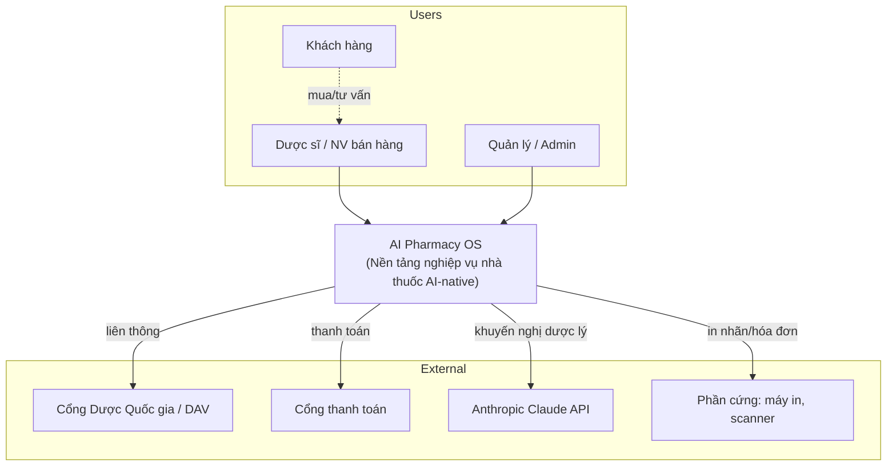
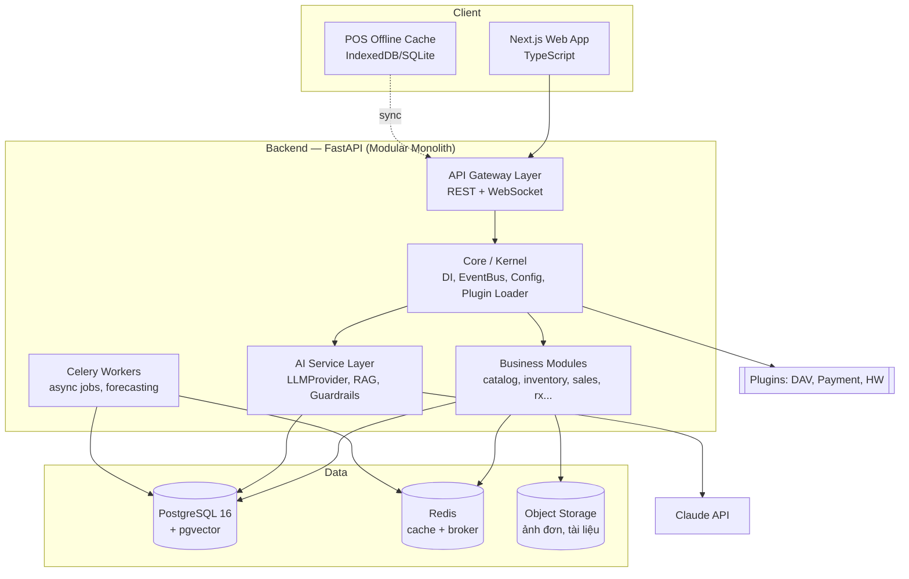
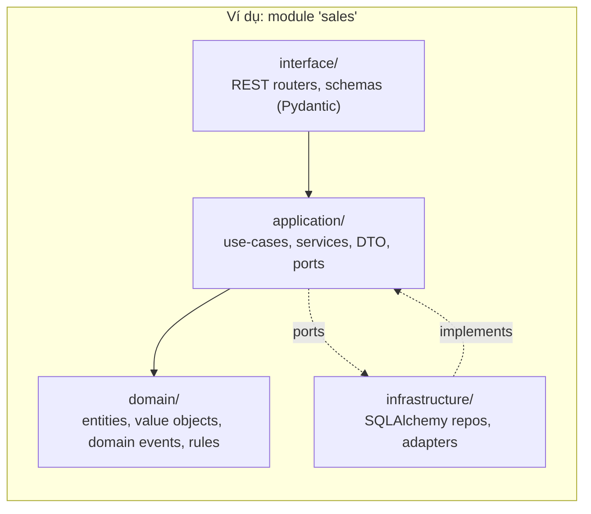
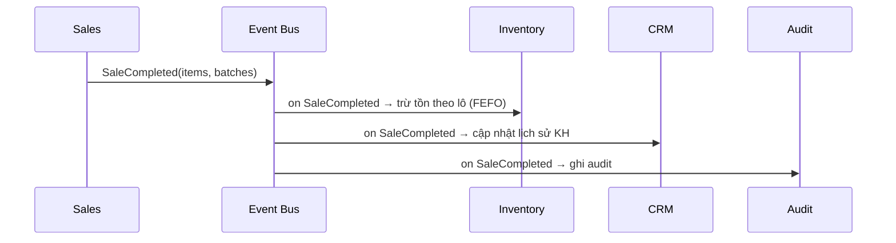
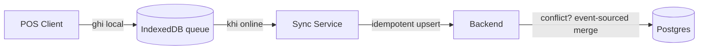
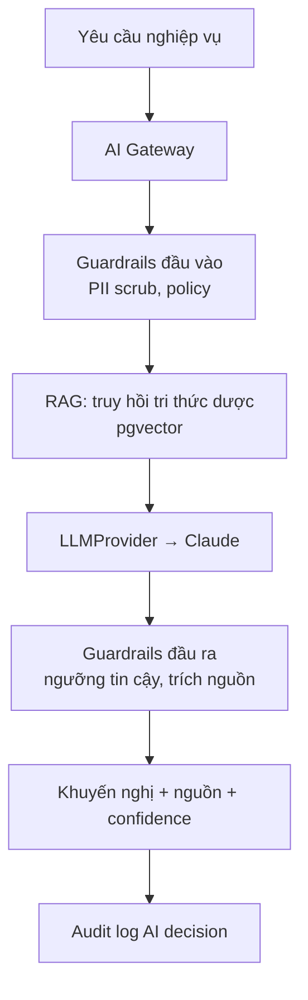

# 02 — KIẾN TRÚC HỆ THỐNG (Architecture)

> Kiến trúc tổng thể **AI Pharmacy OS**. Xem kèm [08_MODULES.md](08_MODULES.md), [09_PLUGIN_SYSTEM.md](09_PLUGIN_SYSTEM.md).

---

## 1. Nguyên tắc kiến trúc (Architecture Principles)

1. **Modular Monolith trước, Microservice sau** — khởi đầu 1 deployable, ranh giới module rõ ràng để tách sau này với chi phí thấp.
2. **Clean / Hexagonal per module** — mỗi module có `domain → application → infrastructure → interface`; domain không phụ thuộc framework.
3. **Event-driven nội bộ** — module giao tiếp qua **domain events** trên in-process event bus (nâng cấp lên message broker khi tách service).
4. **AI là adapter, không phải lõi** — mọi lời gọi LLM đi qua cổng `LLMProvider`; có thể thay đổi model/nhà cung cấp.
5. **Human-in-the-loop** — AI khuyến nghị; người dùng có thẩm quyền quyết định.
6. **Plugin-first cho phần biến động** — liên thông pháp lý, cổng thanh toán, phần cứng là plugin, không sửa lõi.
7. **Offline-first cho POS** — ghi cục bộ, đồng bộ khi có mạng.
8. **Secure & Auditable by default** — RBAC + audit log là hạ tầng, không phải tính năng thêm.

---

## 2. Sơ đồ ngữ cảnh (C4 — Level 1: System Context)

---

## 3. Sơ đồ Container (C4 — Level 2)

---

## 4. Kiến trúc phân lớp trong 1 module (Hexagonal)

**Quy tắc phụ thuộc (Dependency Rule):** mũi tên phụ thuộc luôn hướng vào `domain`. `domain` không import framework (FastAPI, SQLAlchemy). `application` định nghĩa **ports** (interface); `infrastructure` **implements** chúng — Dependency Inversion.

---

## 5. Kernel / Core (nhân hệ thống)

Core cung cấp năng lực dùng chung, không chứa nghiệp vụ:

| Thành phần | Trách nhiệm |
|------------|-------------|
| **DI Container** | Đăng ký & phân giải phụ thuộc (dùng `dependency-injector` hoặc provider thủ công) |
| **Event Bus** | Pub/sub domain events in-process; interface sẵn sàng thay bằng broker |
| **Config Service** | Tải cấu hình phân lớp (env → file → DB), validate bằng Pydantic Settings |
| **Plugin Loader** | Khám phá & nạp plugin qua entry points, đăng ký hook |
| **Auth/RBAC** | Middleware xác thực, phân quyền, ngữ cảnh tenant/branch |
| **Audit** | Ghi log bất biến các sự kiện nhạy cảm |
| **Unit of Work** | Quản lý transaction xuyên repository |
| **AI Gateway** | Cổng chung tới LLMProvider + guardrails |

---

## 6. Luồng giao tiếp giữa các module (Event-driven)

Module **không gọi trực tiếp** vào nhau; chúng phát/nghe **domain events**.

Điều này giữ module **lỏng lẻo (loosely coupled)** và cho phép tách microservice bằng cách thay Event Bus in-process bằng message broker (RabbitMQ/Kafka) mà không đổi domain.

---

## 7. Chiến lược Multi-branch / Multi-tenant

- **Mô hình:** *Shared database, shared schema, row-level tenant isolation* qua cột `tenant_id` + `branch_id`.
- Mọi truy vấn đi qua **repository base** tự chèn điều kiện tenant/branch từ `RequestContext`.
- Nâng cấp tương lai: schema-per-tenant cho khách hàng lớn (đã tách sẵn ở tầng repository).

---

## 8. Offline-first cho POS

- Đơn bán được gán **client-generated UUID** + **sequence** để idempotent.
- Tồn kho dùng **event-sourcing** cho các chuyển động (movements) để hòa giải xung đột theo thứ tự thời gian.

---

## 9. Tầng AI (tổng quan — chi tiết tại [12_AI_INTEGRATION.md](12_AI_INTEGRATION.md))

---

## 10. Quyết định kiến trúc (ADR — tóm tắt)

| ADR | Quyết định | Lý do |
|-----|-----------|-------|
| ADR-001 | Modular Monolith thay vì microservice ngay | Giảm chi phí vận hành sớm, ranh giới rõ để tách sau |
| ADR-002 | Python/FastAPI | Hệ sinh thái AI/ML mạnh, async, năng suất cao |
| ADR-003 | PostgreSQL + pgvector | 1 DB cho cả quan hệ + vector RAG, giảm hạ tầng |
| ADR-004 | Hexagonal per module | Kiểm thử domain độc lập, dễ thay adapter |
| ADR-005 | AI qua cổng `LLMProvider` | Tránh khóa nhà cung cấp, dễ swap Claude model |
| ADR-006 | Plugin cho compliance/payment | Quy định thay đổi thường xuyên, cô lập biến động |
| ADR-007 | Event-driven nội bộ | Giảm coupling, chuẩn bị cho phân tán |

> ADR đầy đủ sẽ được lưu tại `docs/adr/NNN-*.md` trong Sprint 2.
