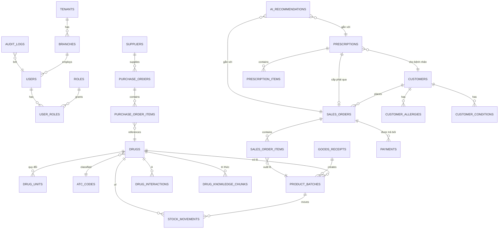
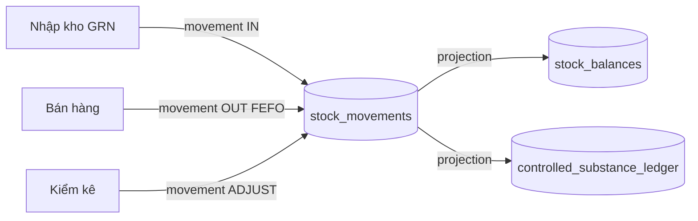

# 03 — CƠ SỞ DỮ LIỆU & ERD (Database Design)

> PostgreSQL 16 + pgvector. Naming: `snake_case`, bảng số nhiều, khóa chính `id UUID`.
> Mọi bảng nghiệp vụ có `tenant_id`, `branch_id`, `created_at`, `updated_at`, `created_by`.

---

## 1. Nguyên tắc thiết kế dữ liệu

- **UUID v7** làm khóa chính (idempotent, tạo được ở client cho offline POS).
- **Soft delete** qua `deleted_at` cho dữ liệu nghiệp vụ; audit không xóa.
- **Tồn kho = event-sourced**: bảng `stock_movements` là nguồn sự thật; `stock_balances` là view/materialized.
- **Tiền tệ**: lưu `numeric(18,2)`, đơn vị VND, không dùng float.
- **Multi-tenant**: cột `tenant_id` + `branch_id`, index phủ.
- **Vector**: bảng `drug_knowledge_chunks` dùng cột `embedding vector(1536)` cho RAG.

---

## 2. ERD tổng thể (Mermaid)

---

## 3. Nhóm bảng theo bounded context

### 3.1 Identity & Tenancy
| Bảng | Cột chính | Ghi chú |
|------|-----------|---------|
| `tenants` | id, name, tax_code, status | Chuỗi nhà thuốc / pháp nhân |
| `branches` | id, tenant_id, name, gpp_code, address | GPP = mã cơ sở đạt chuẩn |
| `users` | id, tenant_id, email, password_hash, is_active, pharmacist_license | `pharmacist_license` cho vai trò dược sĩ |
| `roles` | id, name, description | admin, pharmacist, cashier, warehouse, manager |
| `permissions` | id, code, description | `sales.create`, `rx.approve`... |
| `role_permissions` | role_id, permission_id | N–N |
| `user_roles` | user_id, role_id, branch_id | Vai trò theo chi nhánh |

### 3.2 Catalog
| Bảng | Cột chính |
|------|-----------|
| `atc_codes` | code, name, level |
| `active_ingredients` | id, name, name_en |
| `drugs` | id, tenant_id, name, registration_no (SĐK), atc_code, form (dạng bào chế), strength, rx_class (OTC/ETC/CONTROLLED), barcode, base_unit |
| `drug_ingredients` | drug_id, ingredient_id, amount, unit |
| `drug_units` | id, drug_id, unit_name, factor (hệ số về base_unit), is_sellable |

### 3.3 Inventory
| Bảng | Cột chính |
|------|-----------|
| `product_batches` | id, drug_id, branch_id, lot_no, expiry_date, mfg_date, cost_price, quantity_received |
| `stock_movements` | id, drug_id, batch_id, branch_id, type (IN/OUT/ADJUST/TRANSFER), quantity, ref_type, ref_id, occurred_at |
| `stock_balances` | drug_id, batch_id, branch_id, quantity (materialized) |
| `stock_takes` | id, branch_id, status, counted_at |
| `stock_take_items` | stock_take_id, batch_id, system_qty, counted_qty, variance |

### 3.4 Procurement
| Bảng | Cột chính |
|------|-----------|
| `suppliers` | id, tenant_id, name, tax_code, contact |
| `purchase_orders` | id, supplier_id, branch_id, status, ordered_at, total |
| `purchase_order_items` | po_id, drug_id, quantity, unit_price |
| `goods_receipts` | id, po_id, branch_id, received_at, received_by |

### 3.5 Sales
| Bảng | Cột chính |
|------|-----------|
| `sales_orders` | id, client_uuid (offline idempotency), branch_id, customer_id, cashier_id, prescription_id?, status, subtotal, vat, total, created_at |
| `sales_order_items` | id, order_id, drug_id, batch_id, quantity, unit_price, line_total |
| `payments` | id, order_id, method (CASH/CARD/WALLET/QR), amount, status, ref |
| `sales_returns` | id, order_id, reason, refund_amount, approved_by |

### 3.6 Prescription (Rx)
| Bảng | Cột chính |
|------|-----------|
| `prescriptions` | id, customer_id, source (MANUAL/IMAGE/EPRESCRIPTION), doctor_name, doctor_license, diagnosis, image_url, status (DRAFT/VALIDATED/DISPENSED/REJECTED), validated_by |
| `prescription_items` | id, prescription_id, drug_id, dose, frequency, duration, quantity, instructions |

### 3.7 CRM
| Bảng | Cột chính |
|------|-----------|
| `customers` | id, tenant_id, full_name, phone, dob, gender, weight_kg, national_id_hash |
| `customer_allergies` | id, customer_id, ingredient_id, severity, note |
| `customer_conditions` | id, customer_id, condition_code (ICD-10), note |

### 3.8 Clinical / AI
| Bảng | Cột chính |
|------|-----------|
| `drug_interactions` | id, ingredient_a, ingredient_b, severity, mechanism, management, source |
| `drug_knowledge_chunks` | id, drug_id?, source, content, embedding vector(1536), metadata jsonb |
| `ai_recommendations` | id, context_type (SALE/RX/CHAT), context_id, model, prompt_hash, output jsonb, confidence, sources jsonb, accepted_by, created_at |
| `ai_conversations` | id, user_id, customer_id?, started_at |
| `ai_messages` | id, conversation_id, role, content, tokens, created_at |

### 3.9 Compliance & Audit
| Bảng | Cột chính |
|------|-----------|
| `controlled_substance_ledger` | id, drug_id, batch_id, movement_id, opening, change, closing, occurred_at |
| `audit_logs` | id, tenant_id, actor_id, action, entity_type, entity_id, before jsonb, after jsonb, ip, created_at — **append-only** |
| `regulatory_submissions` | id, type, payload jsonb, status, submitted_at, response jsonb |

### 3.10 Platform
| Bảng | Cột chính |
|------|-----------|
| `plugins` | id, key, version, enabled, config jsonb |
| `settings` | id, scope (SYSTEM/TENANT/BRANCH), scope_id, key, value jsonb |
| `outbox_events` | id, aggregate, type, payload jsonb, published_at — transactional outbox |

---

## 4. Ràng buộc & Index quan trọng

- `product_batches`: unique `(drug_id, branch_id, lot_no)`; index `(expiry_date)` cho FEFO & cảnh báo cận date.
- `stock_movements`: index `(drug_id, batch_id, branch_id, occurred_at)`.
- `sales_orders`: unique `(client_uuid)` để idempotent offline sync.
- `drug_knowledge_chunks`: index `ivfflat`/`hnsw` trên `embedding` (cosine).
- `audit_logs`: KHÔNG có UPDATE/DELETE (chỉ INSERT) — enforce bằng trigger/quyền DB.
- Mọi bảng nghiệp vụ: composite index `(tenant_id, branch_id)`.

---

## 5. Migration & phiên bản hóa

- Công cụ: **Alembic**. Mỗi thay đổi schema = 1 migration có `upgrade`/`downgrade`.
- Seed dữ liệu tham chiếu (ATC, đơn vị chuẩn) qua migration riêng `seeds/`.
- pgvector extension bật qua migration `0001_enable_extensions`.

---

## 6. Chiến lược dữ liệu tồn kho (event-sourced)

`stock_balances` được cập nhật đồng bộ trong cùng transaction (Unit of Work) hoặc rebuild từ movements khi cần đối soát.
