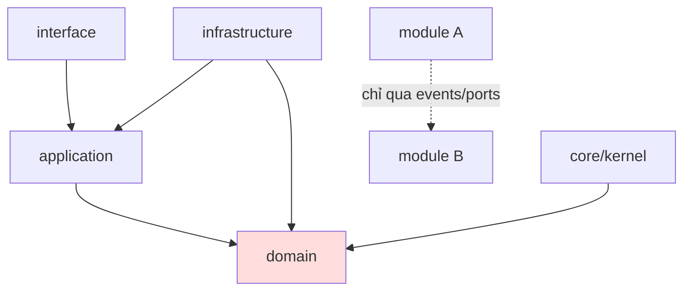

# 05 — PHỤ THUỘC & PACKAGE (Dependencies)

> Danh mục thư viện, lý do chọn, và quy tắc phụ thuộc nội bộ.
> Đây là *thiết kế* — chưa cài đặt. `pyproject.toml`/`package.json` sẽ hiện thực ở Sprint 2.

---

## 1. Backend — Python 3.12

### 1.1 Runtime (core)
| Package | Vai trò | Lý do chọn |
|---------|---------|-----------|
| `fastapi` | Web framework | Async, type-first, OpenAPI tự sinh |
| `uvicorn[standard]` | ASGI server | Chuẩn cho FastAPI |
| `pydantic` v2 | Validation & schema | Nhanh, dùng cho DTO + Settings |
| `pydantic-settings` | Config phân lớp | Env/file → Settings có validate |
| `sqlalchemy` 2.0 | ORM (async) | Ổn định, mapping domain linh hoạt |
| `alembic` | Migration | Chuẩn cho SQLAlchemy |
| `asyncpg` | Driver Postgres async | Hiệu năng cao |
| `pgvector` | Vector type cho RAG | Tích hợp Postgres, giảm hạ tầng |
| `redis` | Cache + broker | Cache, rate-limit, Celery broker |
| `celery` | Async jobs | Forecasting, embeddings, sync |
| `dependency-injector` | DI container | Wiring rõ ràng, testable |
| `anthropic` | Claude SDK | Gọi Claude API (opus-4-8 / sonnet-5) |
| `httpx` | HTTP client async | Gọi plugin/API ngoài |
| `python-jose` / `pyjwt` | JWT | Auth token |
| `passlib[bcrypt]` | Hash mật khẩu | Chuẩn bảo mật |
| `structlog` | Structured logging | Log JSON, audit-friendly |
| `opentelemetry-sdk` | Tracing/metrics | Observability |
| `tenacity` | Retry | Ổn định khi gọi LLM/plugin |

### 1.2 Dev / Test
| Package | Vai trò |
|---------|---------|
| `pytest`, `pytest-asyncio` | Test framework |
| `testcontainers` | Postgres/Redis thật cho integration test |
| `ruff` | Lint + format (thay black/flake8/isort) |
| `mypy` | Type checking tĩnh |
| `import-linter` | **Ép quy tắc phụ thuộc kiến trúc** |
| `coverage` | Đo độ phủ |
| `factory-boy` / `faker` | Dữ liệu test |
| `pre-commit` | Hook chất lượng trước commit |

### 1.3 AI/ML (tùy chọn theo tính năng)
| Package | Vai trò |
|---------|---------|
| `anthropic` | LLM chính |
| `numpy` | Xử lý vector/số liệu forecasting |
| (embeddings) | Sinh embedding cho RAG — qua provider được cấu hình |

---

## 2. Frontend — Node 20 / Next.js

| Package | Vai trò |
|---------|---------|
| `next`, `react`, `react-dom` | Framework UI |
| `typescript` | Type safety |
| `@tanstack/react-query` | Data fetching / cache |
| `zod` | Validation client, đồng bộ schema |
| `dexie` | IndexedDB wrapper cho offline POS |
| `tailwindcss` | Styling |
| `zustand` | State cục bộ POS |
| `vitest`, `@testing-library/react` | Test |
| `eslint`, `prettier` | Lint/format |

---

## 3. Ma trận phụ thuộc nội bộ (Internal Dependency Rules)

Ép bằng **import-linter** (`.importlinter`). Vi phạm = fail CI.



**Luật:**
1. `domain` **không** import: `fastapi`, `sqlalchemy`, `anthropic`, hay bất kỳ module nghiệp vụ khác.
2. `application` chỉ phụ thuộc `domain` + `core` (qua abstraction).
3. `infrastructure` được phép chạm DB/SDK; **implements** ports của `application`.
4. Module **không** import trực tiếp module khác — chỉ qua **domain events** hoặc **ports** đăng ký ở `core`.
5. `core` không được import `modules/*` (kernel không biết nghiệp vụ).

### Ví dụ cấu hình `.importlinter` (thiết kế)
```ini
[importlinter]
root_package = pharmacy_os

[importlinter:contract:layers]
name = Hexagonal layers
type = layers
layers =
    pharmacy_os.modules.*.interface
    pharmacy_os.modules.*.application
    pharmacy_os.modules.*.domain

[importlinter:contract:domain-purity]
name = Domain khong cham framework
type = forbidden
source_modules = pharmacy_os.modules.*.domain
forbidden_modules = fastapi | sqlalchemy | anthropic

[importlinter:contract:module-isolation]
name = Modules khong goi truc tiep nhau
type = independence
modules =
    pharmacy_os.modules.sales
    pharmacy_os.modules.inventory
    pharmacy_os.modules.catalog
```

---

## 4. Quản lý phiên bản & khóa (Version pinning)

- Backend: `pyproject.toml` (PEP 621) + `uv`/`pip-tools` sinh lockfile (`uv.lock`).
- Frontend: `pnpm` + `pnpm-lock.yaml`.
- Chính sách: **pin chặt** ở production, cập nhật qua Renovate/Dependabot có review.
- Tách nhóm: `dependencies`, `dev`, `ai`, `plugins` (optional extras).

---

## 5. Bảng chọn công nghệ ngoài (External Services)

| Dịch vụ | Dùng cho | Thay thế được? |
|---------|----------|----------------|
| Anthropic Claude | Khuyến nghị dược, RAG, OCR đơn | Có — qua `LLMProvider` port |
| PostgreSQL + pgvector | Dữ liệu + vector | Có — repository abstraction |
| Redis | Cache/broker | Có — cache port |
| Object storage (S3-compatible) | Ảnh đơn thuốc | Có — storage port |
| Cổng Dược Quốc gia (DAV) | Liên thông pháp lý | Plugin |
| VNPay/Momo | Thanh toán | Plugin |

Mọi phụ thuộc ngoài đều nằm sau **port/adapter** để tránh khóa nhà cung cấp (xem ADR-005, ADR-006 trong [02_ARCHITECTURE.md](02_ARCHITECTURE.md)).
