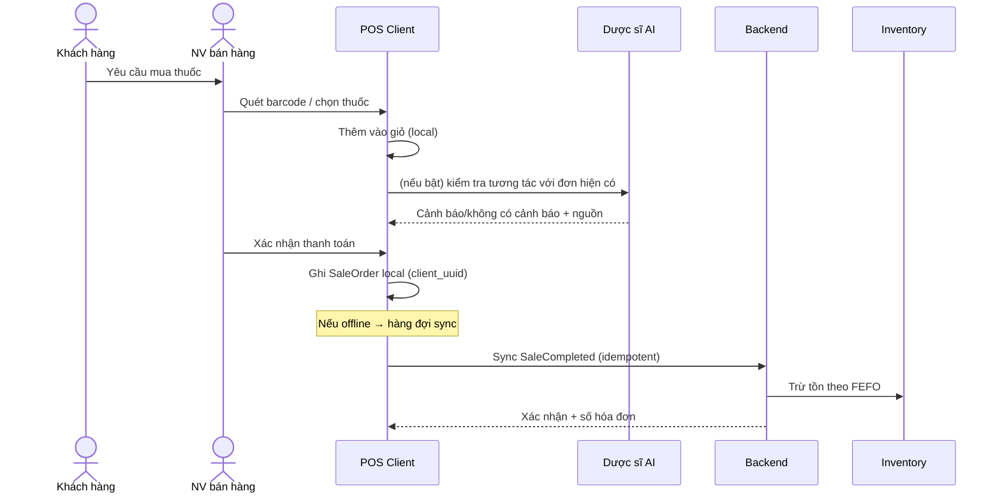
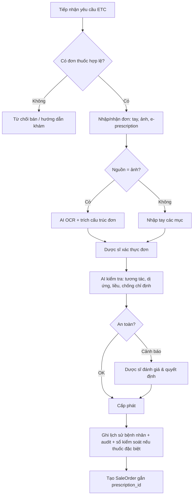
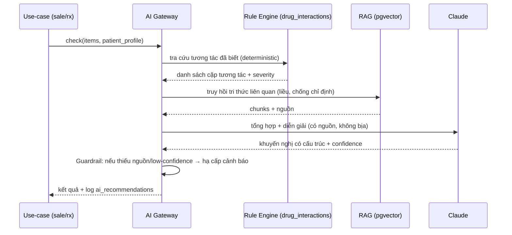
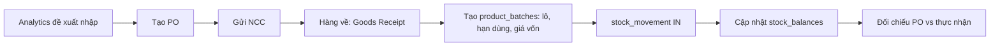
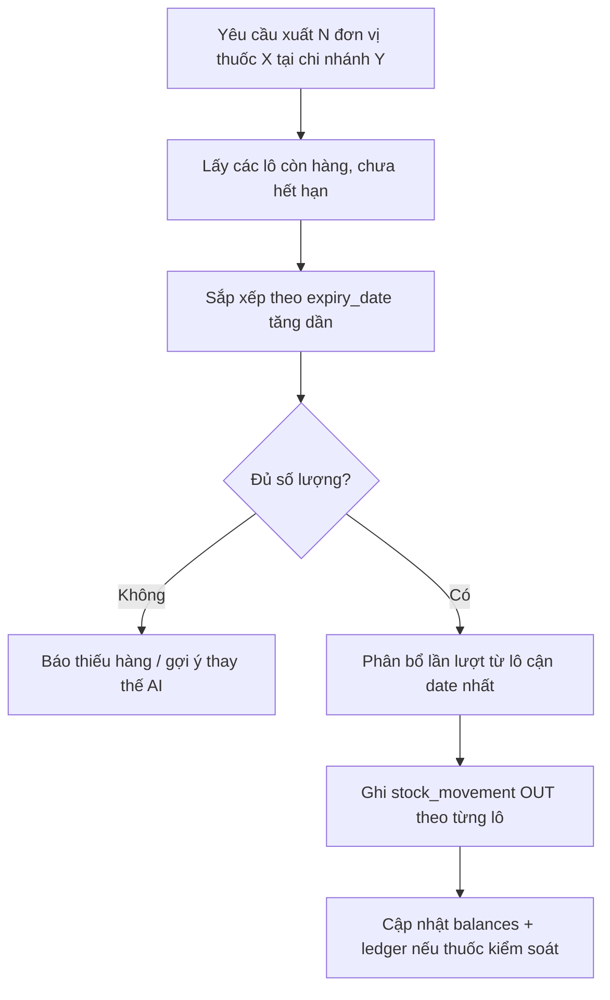
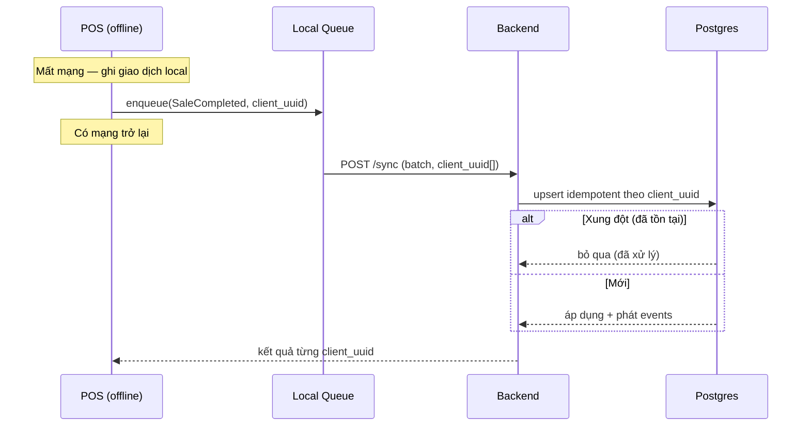
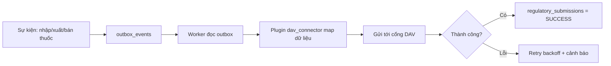
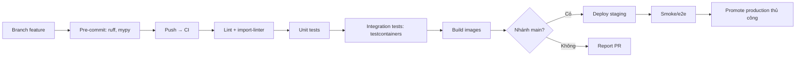

# 06 — QUY TRÌNH NGHIỆP VỤ (Workflows)

> Các luồng nghiệp vụ chính dạng sequence/flow. Kết nối với FR trong [01_ANALYSIS.md](01_ANALYSIS.md).

---

## 1. Bán thuốc OTC tại POS (offline-first)

---

## 2. Bán thuốc kê đơn (ETC) có kiểm soát

> **Nguyên tắc an toàn:** bước H là *khuyến nghị*; bước J/K do **dược sĩ** quyết định. AI không tự cấp phát (NFR — human-in-the-loop).

---

## 3. Kiểm tra tương tác thuốc (Clinical/AI)

> **Lai (hybrid):** ưu tiên **rule engine tất định** cho tương tác đã biết; LLM chỉ *diễn giải & bổ sung*, không thay thế nguồn y khoa.

---

## 4. Nhập kho từ nhà cung cấp (Procurement → Inventory)

---

## 5. Xuất kho theo FEFO

---

## 6. Đồng bộ offline (Sync)

---

## 7. Liên thông Dược Quốc gia (Compliance plugin)

---

## 8. Quy trình phát triển & CI/CD (DevWorkflow)

---

## 9. Ma trận Workflow ↔ Module ↔ Event

| Workflow | Module chủ | Events phát ra |
|----------|-----------|----------------|
| Bán OTC | sales | `SaleCompleted` |
| Bán ETC | prescription + sales | `PrescriptionDispensed`, `SaleCompleted` |
| Kiểm tra tương tác | clinical | `AIRecommendationCreated` |
| Nhập kho | procurement + inventory | `GoodsReceived`, `StockMovedIn` |
| Xuất FEFO | inventory | `StockMovedOut` |
| Sync offline | sales | `SaleCompleted` (idempotent) |
| Liên thông DAV | compliance | `RegulatorySubmitted` |
