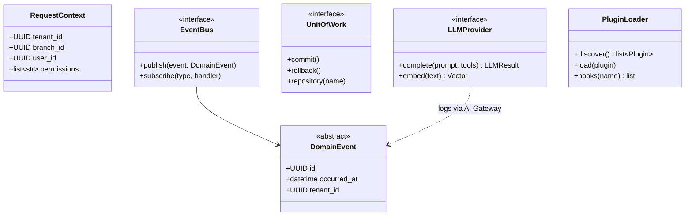
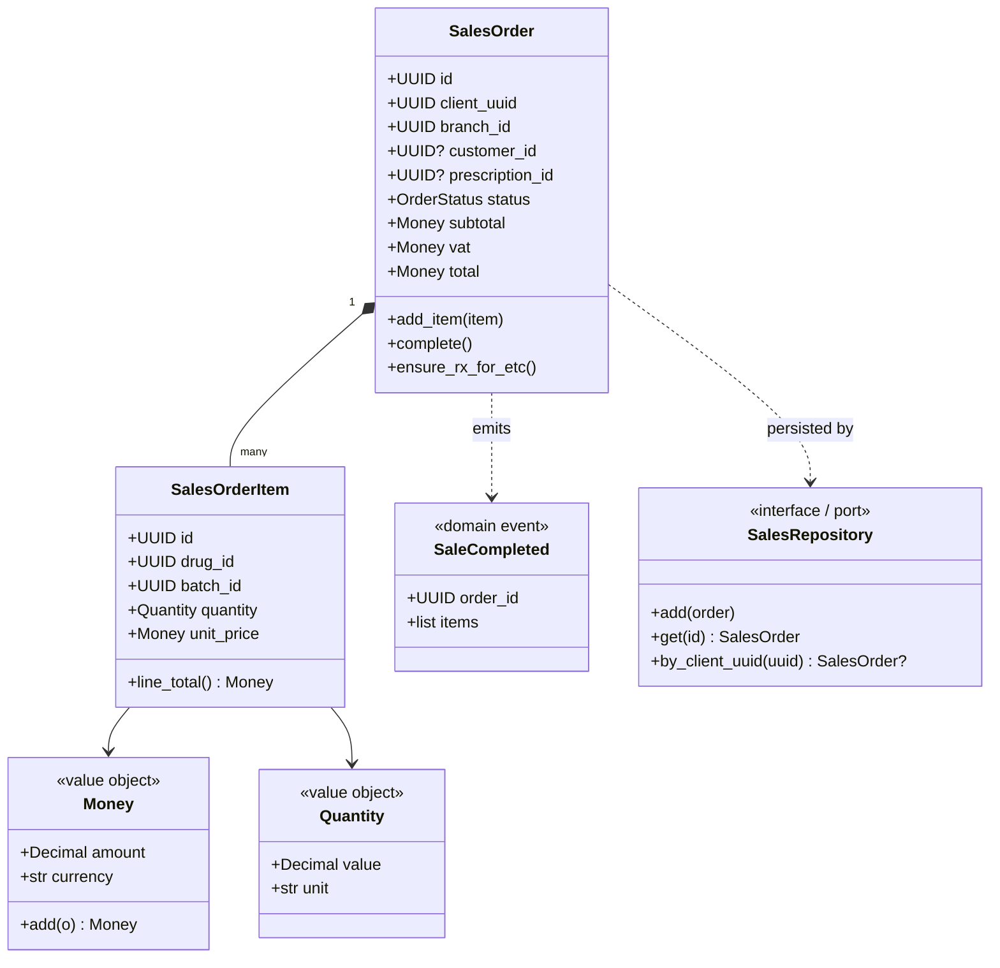
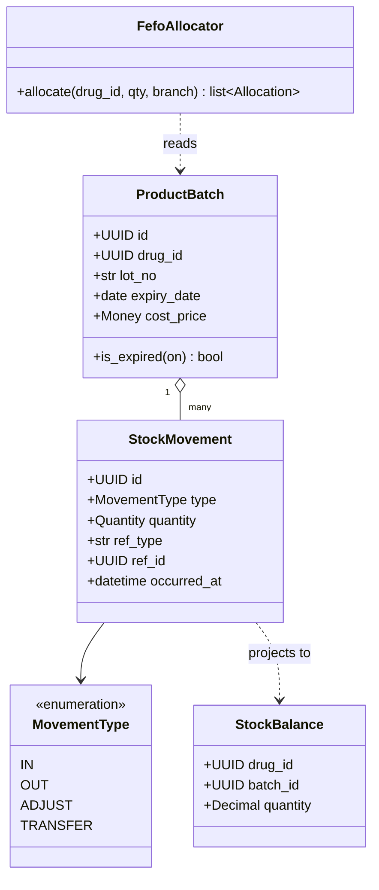
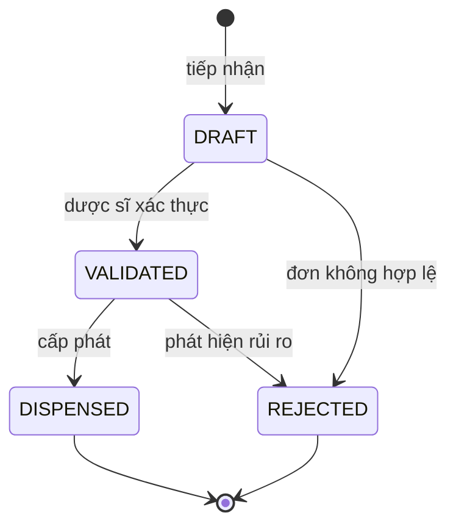
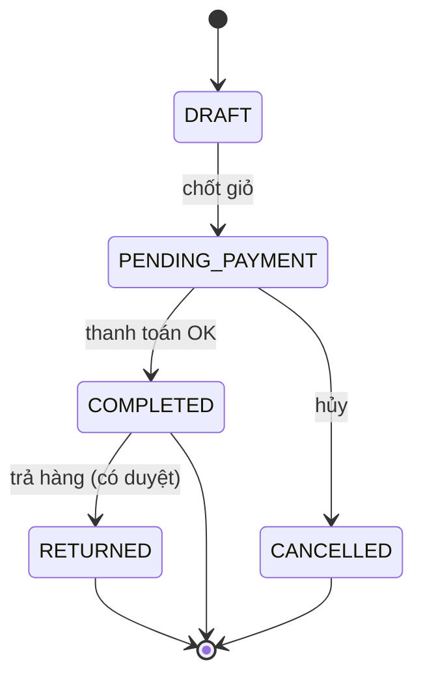
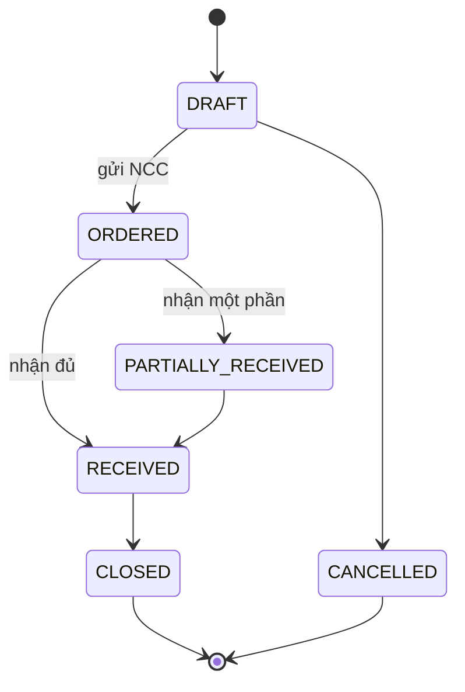
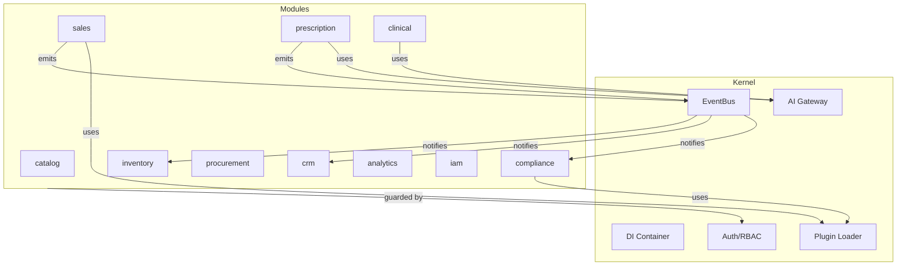
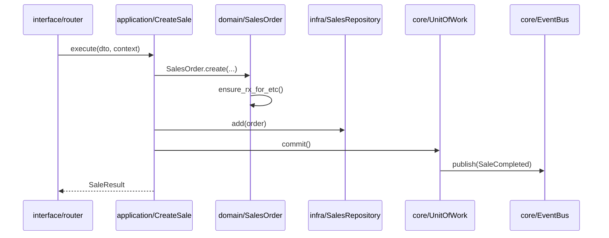

# 07 — UML

> Class diagrams, state machines, component diagrams. Thiết kế mức khái niệm cho domain.

---

## 1. Class Diagram — Core Kernel

---

## 2. Class Diagram — Domain `sales`

---

## 3. Class Diagram — Domain `inventory` (event-sourced)

---

## 4. State Machine — Prescription

---

## 5. State Machine — SalesOrder

---

## 6. State Machine — Purchase Order

---

## 7. Component Diagram — Module & Kernel

---

## 8. Sequence — Use-case `CreateSale` (chi tiết Hexagonal)

---

## 9. Ghi chú UML

- UML ở đây là **mức thiết kế khái niệm**; chữ ký phương thức có thể tinh chỉnh khi hiện thực.
- Value Objects (`Money`, `Quantity`) là bất biến (immutable).
- Aggregate roots: `SalesOrder`, `Prescription`, `ProductBatch`(qua movements), `PurchaseOrder`.
- Diagram nguồn (`.mmd`) sẽ được tách vào `docs/uml/` ở Sprint 2 để CI render.
