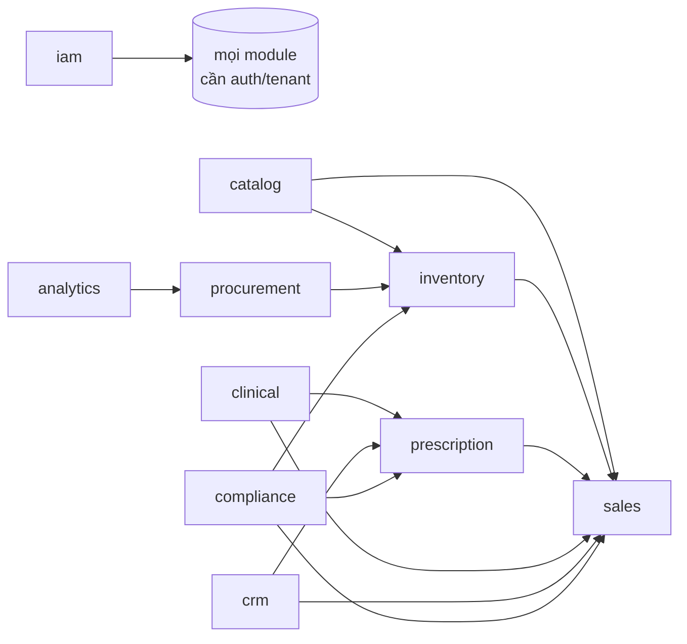

# 08 — MODULE (Business Modules)

> Danh mục bounded context. Mỗi module Hexagonal, giao tiếp qua events/ports.
> Ánh xạ thư mục: [04_FOLDER_STRUCTURE.md](04_FOLDER_STRUCTURE.md) §2.1.

---

## 1. Bản đồ module (Module Map)

---

## 2. Đặc tả từng module

### 2.1 `iam` — Identity & Access
- **Trách nhiệm:** người dùng, vai trò, quyền, tenant/branch context, xác thực.
- **Aggregate:** `User`, `Role`.
- **Ports:** `UserRepository`, `TokenService`.
- **Events:** `UserRegistered`, `RolesChanged`.
- **API:** `/auth/login`, `/users`, `/roles`.

### 2.2 `catalog` — Danh mục thuốc
- **Trách nhiệm:** drug master, hoạt chất, ATC, đơn vị quy đổi, phân loại Rx.
- **Aggregate:** `Drug`.
- **Ports:** `DrugRepository`.
- **Events:** `DrugCreated`, `DrugUpdated`.
- **Cung cấp:** dữ liệu tham chiếu cho inventory/sales/clinical.

### 2.3 `inventory` — Kho
- **Trách nhiệm:** lô, hạn dùng, chuyển động tồn (event-sourced), FEFO, kiểm kê, cảnh báo.
- **Aggregate:** `ProductBatch`, `StockMovement`.
- **Ports:** `BatchRepository`, `MovementRepository`, `FefoAllocator`.
- **Events (nghe):** `SaleCompleted` → OUT; `GoodsReceived` → IN.
- **Events (phát):** `StockMovedIn/Out`, `LowStockDetected`, `NearExpiryDetected`.

### 2.4 `procurement` — Mua hàng
- **Trách nhiệm:** nhà cung cấp, PO, GRN.
- **Aggregate:** `PurchaseOrder`, `Supplier`.
- **Events:** `PurchaseOrdered`, `GoodsReceived`.
- **Tích hợp:** nhận đề xuất từ `analytics`.

### 2.5 `sales` — Bán hàng / POS
- **Trách nhiệm:** đơn bán, thanh toán, trả hàng, idempotent offline.
- **Aggregate:** `SalesOrder`.
- **Rules:** chặn ETC thiếu đơn (`ensure_rx_for_etc`).
- **Events:** `SaleCompleted`, `SaleReturned`.
- **Plugin:** cổng thanh toán.

### 2.6 `prescription` — Đơn thuốc (Rx)
- **Trách nhiệm:** tiếp nhận, OCR/trích xuất AI, xác thực, cấp phát.
- **Aggregate:** `Prescription`.
- **Events:** `PrescriptionValidated`, `PrescriptionDispensed`, `PrescriptionRejected`.
- **Tích hợp:** gọi `clinical` để kiểm tra an toàn.

### 2.7 `clinical` — Lâm sàng / AI dược
- **Trách nhiệm:** kiểm tra tương tác, dị ứng, liều, gợi ý thay thế, dược sĩ AI hội thoại.
- **Cơ chế:** hybrid — rule engine (tất định) + RAG/LLM (diễn giải).
- **Ports:** `InteractionRepository`, `LLMProvider` (qua core/ai), `KnowledgeRetriever`.
- **Events:** `AIRecommendationCreated`.
- **An toàn:** human-in-the-loop, ghi confidence + nguồn.

### 2.8 `crm` — Khách hàng / bệnh nhân
- **Trách nhiệm:** hồ sơ, dị ứng, bệnh nền, lịch sử, loyalty.
- **Aggregate:** `Customer`.
- **Events (nghe):** `SaleCompleted`, `PrescriptionDispensed` → cập nhật lịch sử.

### 2.9 `compliance` — Tuân thủ
- **Trách nhiệm:** sổ thuốc kiểm soát (TT 20/2017), audit, liên thông DAV.
- **Cơ chế:** transactional outbox → worker → plugin `dav_connector`.
- **Events:** `RegulatorySubmitted`.

### 2.10 `analytics` — Phân tích & dự báo
- **Trách nhiệm:** dashboard, dự báo nhu cầu, đề xuất nhập hàng.
- **Cơ chế:** Celery jobs đọc read-model, xuất đề xuất cho procurement.
- **Events:** `ReorderSuggested`.

---

## 3. Bảng tổng hợp module

| Module | Aggregate chính | Phát events | Nghe events | Dùng plugin | Dùng AI |
|--------|-----------------|-------------|-------------|-------------|---------|
| iam | User, Role | UserRegistered | — | — | — |
| catalog | Drug | DrugCreated | — | — | — |
| inventory | ProductBatch | StockMovedIn/Out, LowStock | SaleCompleted, GoodsReceived | — | — |
| procurement | PurchaseOrder | PurchaseOrdered, GoodsReceived | ReorderSuggested | — | — |
| sales | SalesOrder | SaleCompleted, SaleReturned | — | payment | gián tiếp |
| prescription | Prescription | Prescription* | — | — | OCR + safety |
| clinical | — (service) | AIRecommendationCreated | — | — | ✔ chính |
| crm | Customer | — | SaleCompleted, PrescriptionDispensed | — | — |
| compliance | — (ledger) | RegulatorySubmitted | Stock*, Sale* | DAV | — |
| analytics | — (read-model) | ReorderSuggested | Sale*, Stock* | — | forecasting |

---

## 4. Nguyên tắc thêm module mới

1. Tạo thư mục `modules/<name>/` theo 4 lớp Hexagonal.
2. Định nghĩa domain trước (entities, events, ports).
3. Đăng ký router + event handlers trong `__init__.py::register()`.
4. **Không** import module khác — chỉ dùng events/ports.
5. Thêm contract vào `.importlinter`.
6. Viết unit test domain trước khi hiện thực infrastructure.
