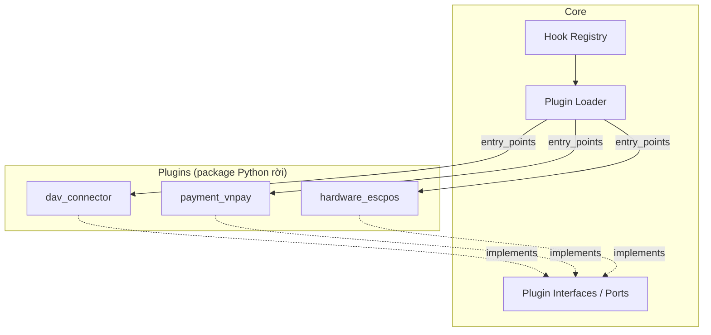
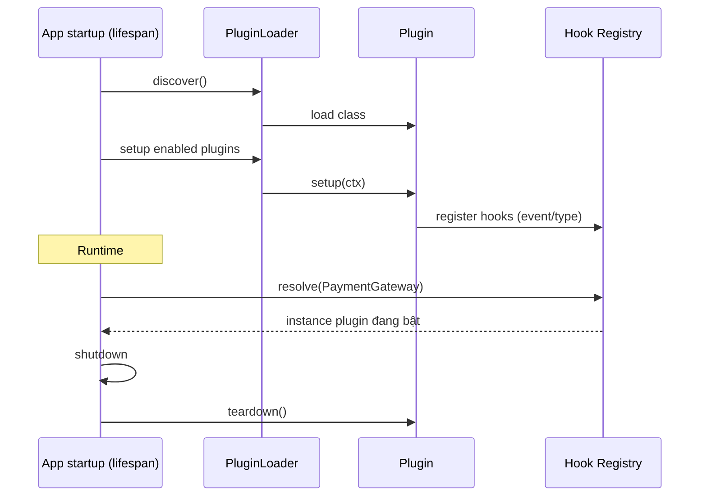

# 09 — HỆ THỐNG PLUGIN (Plugin System)

> Cơ chế mở rộng cho phần biến động: liên thông pháp lý, thanh toán, phần cứng.
> Mục tiêu: thêm/bớt năng lực **không sửa lõi**.

---

## 1. Vì sao cần plugin

Những phần thay đổi ngoài tầm kiểm soát của team lõi:
- **Quy định DAV / Bộ Y tế** đổi định dạng liên thông.
- **Cổng thanh toán** (VNPay, Momo, ZaloPay...) khác API.
- **Phần cứng** (máy in nhãn, cân, scanner) khác giao thức.

Cô lập chúng thành plugin → lõi ổn định, biến động khu trú.

---

## 2. Kiến trúc plugin



---

## 3. Cơ chế khám phá (Discovery)

Dùng **Python entry points** (`importlib.metadata`). Mỗi plugin khai báo trong `pyproject.toml`:

```toml
# plugins/payment_vnpay/pyproject.toml
[project.entry-points."pharmacy_os.plugins"]
vnpay = "payment_vnpay.plugin:VNPayPlugin"
```

`PluginLoader` quét group `pharmacy_os.plugins`, nạp class, gọi `setup()`, đăng ký hook. Bật/tắt & cấu hình qua bảng `plugins` (DB) + [10_CONFIG.md](10_CONFIG.md).

---

## 4. Giao diện plugin (Interfaces / Contracts)

Thiết kế các **abstract base** trong `core/plugins/interfaces.py`:

```python
# THIẾT KẾ — pseudo-code, hiện thực ở Sprint 2
class Plugin(Protocol):
    key: str
    version: str
    def setup(self, ctx: PluginContext) -> None: ...
    def teardown(self) -> None: ...

class PaymentGateway(Plugin, Protocol):
    def create_charge(self, order_id, amount, method) -> ChargeResult: ...
    def verify_callback(self, payload) -> PaymentStatus: ...

class RegulatoryConnector(Plugin, Protocol):
    def map_event(self, event: DomainEvent) -> dict: ...
    def submit(self, payload: dict) -> SubmissionResult: ...

class HardwareDriver(Plugin, Protocol):
    def print_label(self, batch) -> None: ...
    def print_invoice(self, order) -> None: ...
```

Plugin **chỉ phụ thuộc contract của core**, không chạm domain module → tách rời an toàn.

---

## 5. Vòng đời & Hook



**Loại hook:**
- **Provider hooks** — cung cấp cài đặt cho một port (1 plugin active/port, ví dụ payment mặc định).
- **Event hooks** — nhiều plugin cùng nghe một domain event (ví dụ compliance).
- **Extension points** — thêm menu/route UI (khai báo, FE đọc).

---

## 6. Cách ly & an toàn plugin

| Rủi ro | Biện pháp |
|--------|-----------|
| Plugin lỗi làm sập app | Bọc try/except quanh hook, timeout, mạch ngắt (circuit breaker) |
| Plugin truy cập dữ liệu ngoài phạm vi | Chỉ nhận DTO/context tối thiểu, không truyền session DB thô |
| Xung đột phiên bản | `version` + kiểm tra tương thích API core |
| Bảo mật secret | Secret của plugin lưu ở config store, không hard-code |

---

## 7. Plugin dự kiến (v1)

| Plugin | Loại | Trạng thái |
|--------|------|-----------|
| `dav_connector` | RegulatoryConnector | Thiết kế |
| `payment_vnpay` | PaymentGateway | Thiết kế |
| `payment_momo` | PaymentGateway | Backlog |
| `hardware_escpos` | HardwareDriver | Backlog |
| `ehealth_eprescription` | RegulatoryConnector | Backlog |

---

## 8. Quy trình phát triển plugin

1. Tạo package trong `plugins/<name>/`.
2. Implement contract từ `core/plugins/interfaces`.
3. Khai báo entry point group `pharmacy_os.plugins`.
4. Cấu hình schema riêng (validate bằng Pydantic).
5. Test cách ly (mock core context).
6. Đăng ký & bật qua bảng `plugins`.
