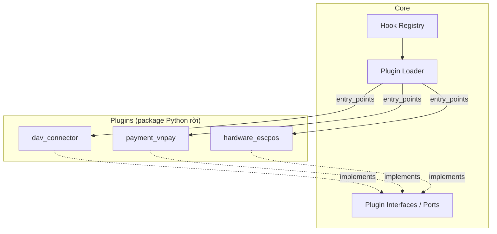
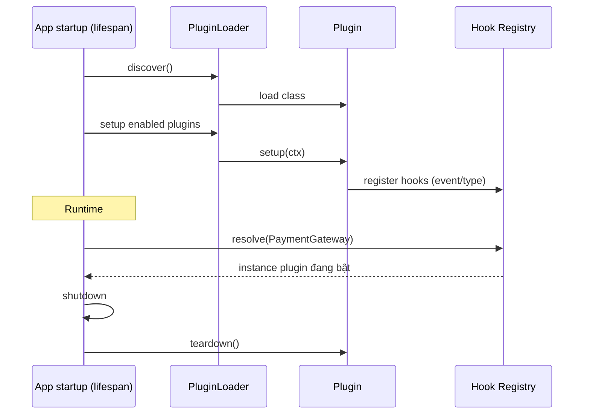

# 09 — HỆ THỐNG PLUGIN (Plugin System)

> Cơ chế mở rộng cho phần biến động: liên thông pháp lý, thanh toán, phần cứng.
> Mục tiêu: thêm/bớt năng lực **không sửa lõi**.

---

## 1. Vì sao cần plugin

Những phần thay đổi ngoài tầm kiểm soát của team lõi:
- **Quy định DAV / Bộ Y tế** đổi định dạng liên thông.
- **Cổng thanh toán** (VNPay, Momo, ZaloPay...) khác API.
- **Phần cứng** (máy in nhãn, cân, scanner) khác giao thức.

Cô lập chúng thành plugin → lõi ổn định, biến động khu trú.

---

## 2. Kiến trúc plugin



---

## 3. Cơ chế khám phá (Discovery)

Dùng **Python entry points** (`importlib.metadata`). Mỗi plugin khai báo trong `pyproject.toml`:

```toml
# plugins/payment_vnpay/pyproject.toml
[project.entry-points."pharmacy_os.plugins"]
vnpay = "payment_vnpay.plugin:VNPayPlugin"
```

`PluginLoader` quét group `pharmacy_os.plugins`, nạp class, **validate**, gọi `setup()`, đăng ký hook.

**Bật/tắt & cấu hình qua biến môi trường** `PLUGINS__ENABLED` + `PLUGINS__CONFIG` (xem
[10_CONFIG.md](10_CONFIG.md)) — **KHÔNG phải bảng `plugins` trong CSDL** như bản thiết kế gốc mô tả.
Sửa 2026-07-26 (Sprint 8, Chain duyệt): cờ cấu hình đủ cho DoD *"bật/tắt plugin không sửa lõi"*, khớp
khuôn `OUTBOX__RELAY_ENABLED`/`NATIONAL_SYNC__RETRY_ENABLED` đã dùng nhiều lần, và tránh một bảng +
migration + API quản trị khi chưa có nhu cầu bật/tắt **theo từng tenant**. Nếu sau này cần per-tenant
thì mới quay lại phương án bảng CSDL — quyết định đó chưa tới.

**Khám phá tách khỏi bật/tắt:** `discover()` liệt kê mọi plugin **đã cài**; chỉ những key có trong
`PLUGINS__ENABLED` mới thật sự được nạp. Cài package ≠ bật plugin.

---

## 4. Giao diện plugin (Interfaces / Contracts)

Thiết kế các **abstract base** trong `core/plugins/interfaces.py`:

```python
# HIỆN THỰC THẬT (Sprint 8) — core/plugins/interfaces.py
CORE_PLUGIN_API_VERSION = "1.0"   # phiên bản CONTRACT, khác Plugin.version

class Plugin(Protocol):
    key: str
    version: str        # phiên bản của chính plugin
    api_version: str    # viết cho contract lõi bản nào — so khớp MAJOR
    def setup(self, ctx: PluginContext) -> None: ...
    def teardown(self) -> None: ...

class PaymentGateway(Plugin, Protocol):
    async def create_charge(self, order_id, amount, method) -> dict: ...
    async def verify_callback(self, payload) -> str: ...

class RegulatoryConnector(Plugin, Protocol):
    def map_event(self, event: dict) -> dict: ...        # thuần, không I/O ⇒ sync
    async def submit(self, payload: dict) -> dict: ...   # qua mạng ⇒ async

# HardwareDriver: backlog, chưa hiện thực
```

**Hook runtime là `async` — quyết định quan trọng nhất của bề mặt plugin** (đổi 2026-07-26, Sprint 8):
chúng gọi mạng, mà hàm đồng bộ gọi mạng sẽ **đứng cả event loop** — mọi quầy trong nhà thuốc treo vì
một terminal chờ cổng thanh toán chậm. Đây cũng là hình dạng duy nhất `asyncio.wait_for` timeout được,
tức là biến yêu cầu "timeout" ở mục 6 từ mong muốn thành thứ cưỡng chế được. `map_event` giữ **sync**
vì là biến đổi thuần, không I/O.

Plugin **chỉ phụ thuộc contract của core**, không chạm domain module → tách rời an toàn.

---

## 5. Vòng đời & Hook



**Loại hook:**
- **Provider hooks** — cung cấp cài đặt cho một port (1 plugin active/port, ví dụ payment mặc định).
- **Event hooks** — nhiều plugin cùng nghe một domain event (ví dụ compliance).
- **Extension points** — thêm menu/route UI (khai báo, FE đọc).

---

## 6. Cách ly & an toàn plugin

| Rủi ro | Biện pháp | Trạng thái |
|--------|-----------|-----------|
| Plugin **đã bật** nạp lỗi lúc khởi động | **FAIL-FAST — app từ chối khởi động** (đổi 2026-07-26). Trước đây log rồi bỏ qua; bỏ qua im lặng chỉ dời lỗi tới lúc thu ngân bấm thanh toán vào cổng chưa từng tồn tại. Khớp tiền lệ `APP__ENV=prod` + `ALLOW_DEV_AUTH=true` ⇒ từ chối khởi động. Bật plugin **chưa cài** cũng fail-fast | ✅ Sprint 8 |
| Plugin lỗi lúc **chạy** | try/except tại điểm gọi + timeout (`asyncio.wait_for`, khả thi nhờ hook async) | ⏳ Khi có điểm gọi thật (`payment_vnpay`) |
| `teardown()` lỗi | **Vẫn phòng thủ** (log, chạy tiếp) — đang tắt máy, 1 plugin lỗi không được bỏ qua phần dọn dẹp của plugin khác | ✅ Sprint 8 |
| Hai plugin cùng nhận 1 port | `HookRegistry` ném `ProviderConflictError` nêu tên **cả hai**, không lặng lẽ chọn cái cuối (nếu không, cổng nào thật sự chạy sẽ phụ thuộc thứ tự duyệt entry point — vô hình trong code, đúng ở dev, sai ở prod) | ✅ Sprint 8 |
| Plugin truy cập dữ liệu ngoài phạm vi | `PluginContext` chỉ mang `config` — không session CSDL, không UoW, không container | ✅ Sprint 8 |
| Xung đột phiên bản | `api_version` + so khớp **major** với `CORE_PLUGIN_API_VERSION`, kiểm **trước** khi gọi `setup()` ⇒ plugin bị từ chối không bao giờ chạy code của nó | ✅ Sprint 8 |
| Bảo mật secret | Secret của plugin nằm trong `PLUGINS__CONFIG`, không hard-code | ✅ Sprint 8 |
| Mạch ngắt (circuit breaker) | **HOÃN có chủ đích** — quá tay khi mới có 1 plugin; cần số liệu thật mới đặt ngưỡng đúng | ⏳ Nợ đã ghi |
| **Sandbox thật** (giới hạn CPU/mạng/tệp) | **KHÔNG có.** Chỉ cô lập lỗi, không cô lập tài nguyên. Chấp nhận vì mọi plugin đều first-party — **giả định dài hạn**, mọi plugin sau này thừa hưởng | ⚠️ Rủi ro đã chấp nhận (Chain duyệt 2026-07-26) |

### Ranh giới phụ thuộc — nợ chưa đóng được

Lời hứa *"plugin chỉ phụ thuộc contract của lõi, không chạm domain module"* (mục 4) **hiện chưa có
cổng CI nào cưỡng chế**. `.importlinter` đặt `root_package = pharmacy_os`, nên package plugin nằm
ngoài cây đó là **vô hình** với cả 16 contract. Đã thử thêm `root_packages` trỏ tới `payment_vnpay`
và import-linter báo thẳng `Could not find package 'payment_vnpay' in your Python path` — **không thể
viết contract cho package chưa tồn tại**.

⇒ **2 contract phải thêm cùng lúc với plugin đầu tiên** (`payment_vnpay`, mục 4/4 Sprint 8), không
được quên: (1) plugin **cấm** import `pharmacy_os.modules`; (2) plugin chỉ được import
`pharmacy_os.core.plugins`, cấm phần còn lại của `core`. Đây là lúc ranh giới có động cơ thật để bị
phá — `payment_vnpay` cần biết về đơn hàng, mà đơn hàng nằm trong `sales`.

---

## 7. Plugin dự kiến (v1)

| Plugin | Loại | Trạng thái |
|--------|------|-----------|
| `dav_connector` | RegulatoryConnector | Thiết kế |
| `payment_vnpay` | PaymentGateway | Thiết kế |
| `payment_momo` | PaymentGateway | Backlog |
| `hardware_escpos` | HardwareDriver | Backlog |
| `ehealth_eprescription` | RegulatoryConnector | Backlog |

---

## 8. Quy trình phát triển plugin

1. Tạo package trong `plugins/<name>/`.
2. Implement contract từ `core/plugins/interfaces`.
3. Khai báo entry point group `pharmacy_os.plugins`.
4. Cấu hình schema riêng (validate bằng Pydantic).
5. Test cách ly (mock core context).
6. Bật qua `PLUGINS__ENABLED` (không phải bảng `plugins` — xem mục 3).
