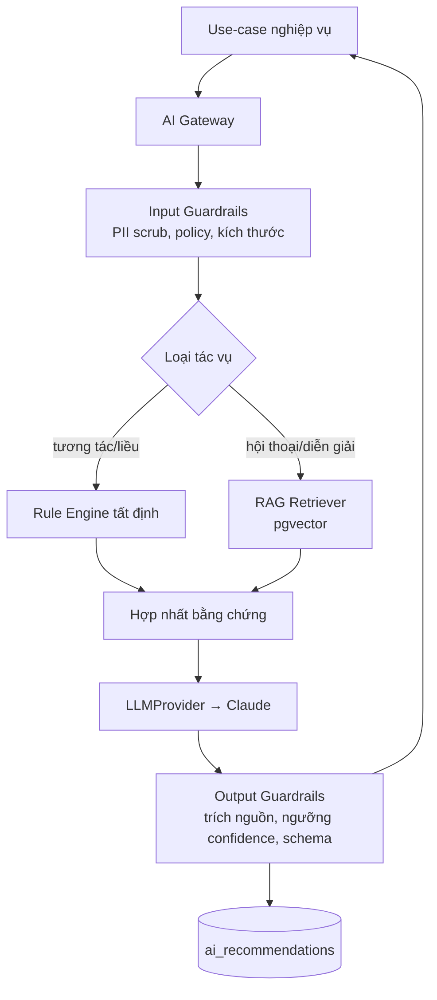
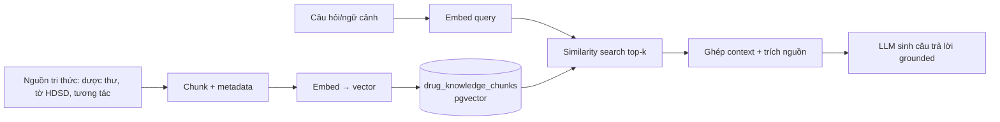

# 12 — TÍCH HỢP AI (AI Integration)

> Cách AI được nhúng an toàn vào nghiệp vụ dược. Nguyên tắc: **AI khuyến nghị, người quyết định.**

---

## 1. Triết lý thiết kế AI

1. **Human-in-the-loop bắt buộc** — AI không tự cấp phát/kê thuốc. Mọi khuyến nghị cần người có thẩm quyền chấp nhận.
2. **Hybrid > thuần LLM** — dữ liệu y khoa quan trọng (tương tác, liều) đi qua **rule engine tất định** trước; LLM diễn giải & bổ sung.
3. **Grounded & có nguồn** — RAG trên tri thức dược có bản quyền/được phép; mọi câu trả lời trích nguồn. Không nguồn → hạ độ tin cậy.
4. **Nhà cung cấp có thể thay** — mọi lời gọi qua port `LLMProvider`; Claude là cài đặt mặc định.
5. **Có thể kiểm toán** — mỗi lần gọi ghi `ai_recommendations` (model, prompt hash, output, confidence, nguồn, người chấp nhận).
6. **Riêng tư** — scrub PII bệnh nhân trước khi gửi ra mô hình; tối thiểu hóa dữ liệu.

---

## 2. Các năng lực AI (Use-cases)

| # | Năng lực | Kỹ thuật | Model gợi ý |
|---|----------|----------|-------------|
| A1 | Kiểm tra tương tác thuốc | Rule engine + RAG + LLM diễn giải | claude-opus-4-8 |
| A2 | Kiểm tra liều theo hồ sơ | Rule/công thức + LLM giải thích | claude-sonnet-5 |
| A3 | Gợi ý thuốc thay thế | Truy vấn hoạt chất/ATC + LLM xếp hạng | claude-sonnet-5 |
| A4 | Dược sĩ AI hội thoại (RAG) | RAG streaming | claude-opus-4-8 |
| A5 | Trích xuất đơn từ ảnh | Vision + trích cấu trúc | claude-opus-4-8 |
| A6 | Dự báo nhu cầu | Thống kê/ML (không nhất thiết LLM) | numpy/model riêng |

---

## 3. Kiến trúc AI Gateway



---

## 4. Port `LLMProvider` (abstraction)

```python
# THIẾT KẾ — core/ai/provider.py (pseudo)
class LLMProvider(Protocol):
    def complete(self, messages, tools=None, model=None) -> LLMResult: ...
    def stream(self, messages, model=None) -> Iterator[Token]: ...
    def embed(self, text: str) -> list[float]: ...

class AnthropicProvider(LLMProvider):
    # cài đặt bằng SDK `anthropic`, model từ AISettings
    ...
```

Đổi nhà cung cấp = viết provider mới, không đụng module nghiệp vụ (ADR-005).

---

## 5. RAG cho tri thức dược



- **Chunking** theo mục/đoạn, giữ `drug_id`, `source`, `section`.
- **Index**: HNSW/IVFFlat, cosine.
- **Cập nhật** qua Celery job khi thêm tri thức mới.
- **Không có kết quả liên quan** → trả lời "không đủ dữ liệu", không bịa.

---

## 6. Guardrails

| Giai đoạn | Kiểm soát |
|-----------|-----------|
| **Input** | Scrub PII (tên, SĐT, CCCD) → token ẩn danh; chặn prompt injection; giới hạn kích thước |
| **Retrieval** | Chỉ tri thức được cấp phép; lọc theo tenant nếu có tri thức riêng |
| **Output** | Bắt buộc schema JSON có `sources`, `confidence`; nếu `confidence < min_confidence` → cảnh báo "cần dược sĩ xác nhận" |
| **Safety** | Không đưa liều tuyệt đối như chỉ định cuối; luôn kèm khuyến cáo tham vấn |
| **Post** | Ghi `ai_recommendations`; gắn `context_id` để truy vết |

---

## 7. Ghi log & kiểm toán AI

Mỗi tương tác AI ghi bản ghi bất biến:
```json
{
  "context_type": "SALE",
  "context_id": "…",
  "model": "claude-opus-4-8",
  "prompt_hash": "sha256:…",
  "output": { "warnings": [ ], "confidence": 0.82 },
  "sources": [ { "drug_id":"…", "section":"tương tác" } ],
  "accepted_by": "user-uuid | null",
  "created_at": "2026-07-21T…"
}
```
→ Phục vụ trách nhiệm pháp lý, cải tiến mô hình, và tuân thủ.

---

## 8. Chi phí & hiệu năng

- **Định tuyến model**: tác vụ nặng suy luận → `claude-opus-4-8`; tác vụ nhanh/khối lượng lớn → `claude-sonnet-5`.
- **Cache**: kết quả tương tác cho cùng bộ hoạt chất (Redis) — giảm gọi lặp.
- **Streaming**: hội thoại dùng WS để giảm độ trễ cảm nhận.
- **Batch embeddings**: sinh embedding theo lô trong worker.
- **Ngân sách**: đặt trần token/tenant qua config; giám sát qua metrics.

---

## 9. Ranh giới & tuyên bố an toàn

- AI Pharmacy OS **không** thay thế phán đoán chuyên môn của dược sĩ/bác sĩ.
- Khuyến nghị AI mang tính **hỗ trợ**, phải được người có chứng chỉ hành nghề xem xét.
- Mọi tính năng lâm sàng có thể **tắt** qua config (`ai.enable_clinical`).
- Nội dung y khoa cần **nguồn kiểm chứng**; hệ thống ưu tiên rule tất định hơn suy đoán LLM.
